# BỘ CÔNG THƯƠNG
## TRƯỜNG ĐẠI HỌC SAO ĐỎ
### KHOA CÔNG NGHỆ THÔNG TIN

---

# ĐỒ ÁN TỐT NGHIỆP / ĐỒ ÁN NGÀNH
## ĐỀ TÀI: NGHIÊN CỨU, XÂY DỰNG HỆ THỐNG QUẢN LÝ VẬN ĐƠN, ĐỊNH TUYẾN THÔNG MINH & ĐỐI SOÁT COD TỰ ĐỘNG - ANTIGRAVITY EXPRESS

**Giảng viên hướng dẫn:** ThS. Nguyễn Thị Thu  
**Sinh viên thực hiện:** Hà Tiến Dũng  
**Mã sinh viên:** 2300128  
**Lớp:** DK14-CNTT1  
**Khoa:** Công nghệ thông tin  

---

## LỜI CAM ĐOAN

Tôi xin cam đoan các kết quả đưa ra trong đồ án tốt nghiệp này là các kết quả thu được trong quá trình nghiên cứu, thực nghiệm của tôi dưới sự hướng dẫn của giảng viên hướng dẫn ThS. Nguyễn Thị Thu. Tôi xin cam đoan rằng toàn bộ mã nguồn của hệ thống và các kết quả phân tích, thiết kế, thử nghiệm được mô tả trong báo cáo này hoàn toàn do cá nhân tôi thực hiện và không sao chép bất kỳ kết quả nghiên cứu nào của các tác giả khác.

Mọi tài liệu tham khảo, số liệu khảo sát thực tế và các công cụ mã nguồn mở được sử dụng trong đồ án đều có nguồn gốc rõ ràng và được liệt kê chi tiết trong danh mục tài liệu tham khảo. Nếu có bất kỳ sự gian lận hay vi phạm quy định nào về học thuật, tôi xin chịu hoàn toàn mọi hình thức kỷ luật theo đúng quy chế của nhà trường.

*Hải Dương, ngày 03 tháng 06 năm 2026*  
**Sinh viên thực hiện**  
*(Đã ký)*  
**Hà Tiến Dũng**  

---

## LỜI CẢM ƠN

Lời đầu tiên, em xin bày tỏ lòng biết ơn chân thành và sâu sắc nhất tới ThS. Nguyễn Thị Thu – giảng viên Khoa Công nghệ thông tin, Trường Đại học Sao Đỏ. Trong suốt quá trình em thực hiện nghiên cứu đề tài và hoàn thiện đồ án, cô đã luôn dành thời gian quan tâm, tận tình chỉ bảo, hướng dẫn và đưa ra những định hướng khoa học quý báu, giúp em vượt qua các khó khăn về mặt học thuật cũng như kỹ năng lập trình thực tế.

Em cũng xin trân trọng cảm ơn các thầy cô giáo trong Khoa Công nghệ thông tin và Ban Giám hiệu Trường Đại học Sao Đỏ đã tận tâm truyền đạt cho em những tri thức khoa học, nền tảng công nghệ và kỹ năng nghiệp vụ trong suốt 4 năm học tập dưới mái trường. Những kiến thức quý giá này chính là bệ phóng quan trọng giúp em tự tin hoàn thành đồ án này và vững bước trên con đường sự nghiệp sau này.

Cuối cùng, em xin gửi lời cảm ơn sâu sắc tới gia đình, người thân và tập thể bạn bè lớp DK14-CNTT1 đã luôn động viên, cổ vũ và hỗ trợ em về mọi mặt trong suốt quá trình học tập và làm việc.

Dù đã nỗ lực hết mình để hoàn thiện đồ án một cách chỉn chu nhất, song do giới hạn về mặt thời gian và kinh nghiệm thực tiễn nên đồ án khó tránh khỏi những thiếu sót. Em kính mong nhận được sự nhận xét, góp ý và chỉ bảo quý báu của các thầy cô giáo trong Hội đồng bảo vệ đồ án để hệ thống ngày càng được hoàn thiện hơn.

*Em xin chân thành cảm ơn!*

---

## MỤC LỤC

- **LỜI CAM ĐOAN**
- **LỜI CẢM ƠN**
- **DANH MỤC CÁC BẢNG**
- **DANH MỤC CÁC HÌNH VẼ**
- **MỞ ĐẦU**
  - 1. Tính cấp thiết của đề tài
  - 2. Mục tiêu nghiên cứu
  - 3. Đối tượng nghiên cứu
  - 4. Phạm vi nghiên cứu
  - 5. Phương pháp nghiên cứu
  - 6. Ý nghĩa khoa học và thực tiễn của đồ án
  - 7. Kết cấu của đồ án
- **CHƯƠNG 1: CƠ SỞ LÝ THUYẾT VÀ KIẾN TRÚC HỆ THỐNG**
  - 1.1. Nghiệp vụ Giao nhận Bưu chính Chặng cuối và Tự động hóa Đối soát Tài chính
  - 1.2. Kiến trúc Client-Server và Mô hình phân tán API-First
  - 1.3. Giao diện lập trình ứng dụng (API) và Chuẩn RESTful
  - 1.4. Hệ quản trị cơ sở dữ liệu quan hệ PostgreSQL và SQLAlchemy ORM
  - 1.5. Công nghệ phát triển các phân hệ (Tech Stack)
  - 1.6. Đánh giá các hệ thống vận chuyển thực tế tại Việt Nam
- **CHƯƠNG 2: PHÂN TÍCH VÀ THIẾT KẾ HỆ THỐNG**
  - 2.1. Khảo sát nghiệp vụ bưu cục và mô tả bài toán thực tế
  - 2.2. Sơ đồ phân cấp chức năng (BFD)
  - 2.3. Biểu đồ luồng dữ liệu (DFD)
  - 2.4. Mô hình ca sử dụng (Usecase Diagrams & Tables)
  - 2.5. Thiết kế động của hệ thống (Sơ đồ Hoạt động & Sơ đồ Trình tự)
  - 2.6. Thiết kế cơ sở dữ liệu (ERD & Data Schema)
- **CHƯƠNG 3: XÂY DỰNG ỨNG DỤNG VÀ KẾT QUẢ THỰC NGHIỆM**
  - 3.1. Kiến trúc mã nguồn và công nghệ triển khai
  - 3.2. Cài đặt các thuật toán và hàm xử lý cốt lõi
  - 3.3. Kết quả thực nghiệm hệ thống theo từng vai trò sử dụng
- **KẾT LUẬN VÀ HƯỚNG PHÁT TRIỂN**
- **TÀI LIỆU THAM KHẢO**

---

## DANH MỤC CÁC BẢNG

*   Bảng 1.1: So sánh đặc điểm nghiệp vụ các hệ thống logistics tại Việt Nam
*   Bảng 2.1: Các tác nhân chính và mô tả vai trò hệ thống
*   Bảng 2.2: Đặc tả chi tiết Use Case Tạo vận đơn và định tuyến lộ trình
*   Bảng 2.3: Đặc tả chi tiết Use Case Quét mã vạch nhập/xuất kho (IN/OUT)
*   Bảng 2.4: Đặc tả chi tiết Use Case Giao hàng chặng cuối và ký xác nhận số
*   Bảng 2.5: Đặc tả chi tiết Use Case Đối soát tài chính COD gộp kế toán
*   Bảng 2.6: Đặc tả chi tiết Use Case Cấp phát khóa API Key cho đối tác B2B
*   Bảng 2.7: Đặc tả chi tiết Use Case Tra cứu hành trình vận đơn công khai
*   Bảng 2.8: Đặc tả chi tiết Use Case Điều chỉnh hạn mức giao hàng shipper trong ngày
*   Bảng 2.9: Cấu trúc chi tiết bảng cơ sở dữ liệu `TongKho` (Tổng Kho)
*   Bảng 2.10: Cấu trúc chi tiết bảng cơ sở dữ liệu `ChiNhanh` (Chi Nhánh / Hub)
*   Bảng 2.11: Cấu trúc chi tiết bảng cơ sở dữ liệu `NguoiDung` (Người Dùng)
*   Bảng 2.12: Cấu trúc chi tiết bảng cơ sở dữ liệu `SuperAdmin` (Siêu Quản Trị)
*   Bảng 2.13: Cấu trúc chi tiết bảng cơ sở dữ liệu `SoDiaChi` (Sổ Địa Chỉ)
*   Bảng 2.14: Cấu trúc chi tiết bảng cơ sở dữ liệu `GoiDichVu` (Gói Dịch Vụ)
*   Bảng 2.15: Cấu trúc chi tiết bảng cơ sở dữ liệu `DonHang` (Đơn Hàng)
*   Bảng 2.16: Cấu trúc chi tiết bảng cơ sở dữ liệu `LichSu_TrangThai` (Lịch Sử Hành Trình)
*   Bảng 2.17: Cấu trúc chi tiết bảng cơ sở dữ liệu `DoiSoat` (Chi Tiết Đối Soát Đơn Hàng)
*   Bảng 2.18: Cấu trúc chi tiết bảng cơ sở dữ liệu `HoaDonDoiSoat` (Hóa Đơn Đối Soát Gộp)
*   Bảng 2.19: Cấu trúc chi tiết bảng cơ sở dữ liệu `KhoaAPI` (Khóa API Keys)
*   Bảng 2.20: Cấu trúc chi tiết bảng cơ sở dữ liệu `TinNhan` (Tin Nhắn CSKH)
*   Bảng 2.21: Cấu trúc chi tiết bảng cơ sở dữ liệu `ChamCong` (Bảng Chấm Công)
*   Bảng 2.22: Cấu trúc chi tiết bảng cơ sở dữ liệu `KhieuNai` (Khiếu Nại)
*   Bảng 2.23: Cấu trúc chi tiết bảng cơ sở dữ liệu `DangKyNhanThongBao` (Web Push Token)

---

## DANH MỤC CÁC HÌNH VẼ

*   Hình 1.1: Mô tả luồng vận chuyển chặng ngắn giao trực tiếp dưới 10km
*   Hình 1.2: Sơ đồ kiến trúc 3 lớp (3-Tier Architecture) của Antigravity Express
*   Hình 2.1: Sơ đồ tổ chức phân cấp quản trị doanh nghiệp logistics
*   Hình 2.2: Sơ đồ tiến trình công việc của vận đơn (Sequence Diagram)
*   Hình 2.3: Sơ đồ phân cấp chức năng (BFD - Business Function Diagram)
*   Hình 2.4: Biểu đồ luồng dữ liệu mức khung cảnh (Context DFD)
*   Hình 2.5: Biểu đồ luồng dữ liệu mức đỉnh (Level 0 DFD)
*   Hình 2.6: DFD Level 1 Phân hệ Tạo vận đơn & Định tuyến (Process 2.0)
*   Hình 2.7: DFD Level 1 Phân hệ Đối soát COD & Sao kê Kế toán (Process 4.0)
*   Hình 2.8: Sơ đồ Usecase tổng quan hệ thống
*   Hình 2.9: Sơ đồ mối quan hệ ràng buộc giữa các Use Case (Include & Extend)
*   Hình 2.10: Sơ đồ ca sử dụng - Tạo vận đơn và định tuyến
*   Hình 2.11: Sơ đồ ca sử dụng - Quét mã vạch nhập/xuất kho
*   Hình 2.12: Sơ đồ ca sử dụng - Giao hàng chặng cuối và ký số
*   Hình 2.13: Sơ đồ ca sử dụng - Đối soát tài chính COD gộp
*   Hình 2.14: Sơ đồ ca sử dụng - Cấp phát khóa API Key cho đối tác B2B
*   Hình 2.15: Sơ đồ ca sử dụng - Tra cứu hành trình vận đơn công khai
*   Hình 2.16: Sơ đồ ca sử dụng - Điều chỉnh hạn mức giao hàng shipper trong ngày
*   Hình 2.17: Sơ đồ hoạt động (Activity Diagram) luồng tạo đơn hàng
*   Hình 2.18: Sơ đồ hoạt động (Activity Diagram) luồng quét kho trung chuyển
*   Hình 2.19: Sơ đồ hoạt động (Activity Diagram) luồng giao hàng chặng cuối và ký số
*   Hình 2.20: Sơ đồ hoạt động (Activity Diagram) luồng đối soát COD kế toán
*   Hình 2.21: Sơ đồ trình tự (Sequence Diagram) xác thực JWT tài khoản
*   Hình 2.22: Sơ đồ trình tự (Sequence Diagram) tích hợp đẩy đơn tự động B2B API
*   Hình 2.23: Sơ đồ trình tự (Sequence Diagram) live chat CSKH và chatbot
*   Hình 2.24: Sơ đồ mối quan hệ thực thể (ERD) cơ sở dữ liệu PostgreSQL
*   Hình 3.1: Giao diện tra cứu bưu gửi public và radar quét 3D pha lê
*   Hình 3.2: Giao diện Tạo đơn hàng lẻ B2C có hộp 3D trực quan co giãn
*   Hình 3.3: Giao diện cổng VietQR dynamic MB Bank thanh toán cước phí
*   Hình 3.4: Giao diện Đăng nhập hệ thống (Obsidian Glassmorphism Cyberpunk)
*   Hình 3.5: Giao diện Tạo đơn hàng đối tác (Merchant Order Form) tích hợp chỉ dẫn tuyến đường R2L
*   Hình 3.6: Bản đồ định tuyến OSRM chi tiết chặng trung chuyển liên miền
*   Hình 3.7: Giao diện Cổng tích hợp API B2B Keys & Tài liệu SDK
*   Hình 3.8: Bản mô phỏng kiến trúc kho thông minh Smart Warehouse
*   Hình 3.9: Giao diện Camera quét barcode PDA trong kho (Webcam PDA Scanner)
*   Hình 3.10: Dashboard bưu tá (Shipper Portal) và khung vẽ chữ ký điện tử


---

## MỞ ĐẦU

### 1. Tính cấp thiết của đề tài

Trong bối cảnh hội nhập kinh tế quốc tế và sự phát triển mạnh mẽ của cuộc cách mạng công nghiệp lần thứ tư (Industry 4.0), công nghệ thông tin đã và đang trở thành động lực then chốt thúc đẩy sự thay đổi vượt bậc trong mọi hoạt động kinh tế - xã hội. Một trong những lĩnh vực hưởng lợi trực tiếp, sâu sắc và có tốc độ tăng trưởng nhanh nhất chính là Logistics và Thương mại điện tử (e-Commerce). Tại Việt Nam, thị trường thương mại điện tử ghi nhận sự bùng nổ mạnh mẽ với quy mô đạt hàng chục tỷ đô la mỗi năm. Sự dịch chuyển thói quen mua sắm của người tiêu dùng từ phương thức truyền thống sang trực tuyến đã đặt áp lực vô cùng lớn lên chuỗi cung ứng giao nhận, đặc biệt là khâu giao hàng chặng cuối (last-mile delivery). Các doanh nghiệp chuyển phát nhanh bưu chính buộc phải không ngừng cải tiến quy trình công nghệ nhằm tối ưu hóa thời gian giao nhận, giảm chi phí vận hành và đảm bảo an toàn dòng tiền giao dịch.

Tuy nhiên, qua nghiên cứu thực tế vận hành tại nhiều đơn vị logistics chặng cuối hiện nay, hệ thống quản trị vẫn đang đối mặt với những thách thức và bất cập vô cùng lớn:
*   **Sự bất hợp lý trong định tuyến vận chuyển chặng ngắn:** Quy trình vận chuyển truyền thống thường quy định mọi đơn hàng sau khi gom từ người gửi đều phải đi qua các bưu cục vệ tinh, chuyển về kho tổng phân loại vùng miền rồi mới gán cho shipper đi phát chặng cuối. Quy trình này hoạt động tốt với các đơn hàng liên tỉnh hoặc khoảng cách xa. Tuy nhiên, đối với các đơn hàng nội thành có cự ly ngắn (dưới 10km), việc trung chuyển vòng vèo qua các kho trung gian là hoàn toàn không cần thiết, gây lãng phí thời gian, tăng nguy cơ va đập hỏng hóc bưu phẩm và tiêu hao nhiên liệu thừa. Một giải pháp cho phép tự động nhận diện và định tuyến giao trực tiếp (Direct Routing) từ shipper lấy đơn trực tiếp rồi giao thẳng cho người nhận, đồng thời chỉ đẩy bưu gửi đi qua bưu cục/kho trung chuyển khi cự ly vượt ngưỡng an toàn là một bài toán thực tiễn cần được giải quyết.
*   **Rủi ro tài chính và sự chậm trễ trong dòng tiền đối soát thu tiền hộ (COD):** Hình thức giao hàng thu tiền hộ (COD - Cash on Delivery) vẫn chiếm tỷ trọng chi phối tuyệt đối (hơn 80%) trong các giao dịch e-commerce tại Việt Nam. Quy trình đối soát dòng tiền thu hộ, cước phí vận chuyển, và phí bảo hiểm tại các bưu cục hiện nay đa phần vẫn được kế toán thực hiện thủ công hoặc sử dụng các tệp Excel rời rạc vào cuối tuần/cuối tháng. Việc này không chỉ tốn nhiều nhân lực, dễ phát sinh sai sót, nhầm lẫn trong quá trình tính toán khấu trừ công nợ mà còn gây chậm trễ dòng tiền quay vòng vốn của các chủ shop đối tác (Merchant), làm ảnh hưởng trực tiếp tới uy tín và hiệu quả kinh doanh của đơn vị bưu chính.
*   **Thiếu khả năng tích hợp hệ thống tự động (B2B Integration):** Các cửa hàng kinh doanh, doanh nghiệp bán lẻ trực tuyến (đặc biệt là các chuỗi cửa hàng bán lẻ, trang thương mại điện tử hoạt động liên tục) có nhu cầu tự động hóa hoàn toàn khâu đẩy vận đơn sang các đối tác giao hàng ngay khi khách tạo đơn. Nếu hệ thống logistics không cung cấp cơ chế bảo mật xác thực (chặng Machine-to-Machine) qua cổng REST API sử dụng khóa API Key, nhân viên cửa hàng buộc phải sao chép địa chỉ, số điện thoại để nhập thủ công bưu gửi sang cổng vận chuyển. Quy trình thủ công này làm mất đi tính tức thời của dịch vụ giao hàng nhanh và dễ gây sai lệch dữ liệu.
*   **Khó khăn trong giám sát hiệu năng shipper và quản lý giới hạn công việc:** Các quản lý nhân sự (HR) và điều phối viên gặp khó khăn trong việc theo dõi hạn mức công việc hàng ngày của từng shipper. Nếu không có cơ chế thiết lập hạn mức số đơn shipper có thể nhận tối đa trong ngày (Shipper Daily Quota) linh hoạt, việc gán đơn quá tải cho shipper sẽ làm tăng tỷ lệ giao thất bại, giảm hiệu suất KPI của chi nhánh và gây mất cân bằng năng suất lao động giữa các bưu tá.

Nhận thức rõ các yêu cầu thực tiễn và những khoảng trống công nghệ nêu trên, việc nghiên cứu và xây dựng hệ thống **"Quản lý Vận đơn, Định tuyến Thông minh & Đối soát COD Tự động - Antigravity Express"** là vô cùng cấp thiết. Đề tài được phát triển nhằm cung cấp một giải pháp chuyển đổi số toàn diện cho ngành chuyển phát nhanh chặng cuối, kết hợp định tuyến thông minh, tự động hóa đối soát dòng tiền kế toán, và mở cổng tích hợp API B2B an toàn cho các đối tác liên kết.

### 2. Mục tiêu nghiên cứu

Đề tài đặt ra các mục tiêu nghiên cứu cụ thể bao gồm:
*   **Xây dựng giải pháp quản lý vận đơn đa kênh:** Thiết kế giao diện Portal Merchant hỗ trợ tạo đơn lẻ trực quan (tích hợp mô hình hộp hàng 3D co giãn kích thước động nhằm ước lượng thể tích), tải file Excel số lượng lớn hàng loạt, và hỗ trợ in nhãn nhiệt A6 tiêu chuẩn logistics.
*   **Phát triển thuật toán định tuyến thông minh chặng ngắn và liên tỉnh:** Tích hợp Leaflet Maps và dịch vụ định tuyến OSRM để tính toán lộ trình thực tế. Tự động phân luồng: các đơn hàng chặng ngắn dưới 10km sẽ được định tuyến giao trực tiếp (shipper lấy và đi giao thẳng không qua kho), còn các đơn hàng từ 10km trở lên sẽ được định tuyến tự động qua bưu cục gửi, trung chuyển qua hệ thống Tổng kho vùng miền gần nhất trước khi tới bưu cục đích.
*   **Tự động hóa đối soát tài chính và khấu trừ COD:** Thiết lập quy trình tự động tính toán dòng tiền thực nhận của Shop ngay khi đơn hàng chuyển sang trạng thái thành công theo công thức khấu trừ cước vận tải và phí bảo hiểm bưu gửi. Cho phép kế toán gom nhiều đơn hàng thành hóa đơn đối soát gộp dạng Accordion, phê duyệt thanh toán thông qua quầy VietQR thông minh và xuất sao kê Excel tiếng Việt chuẩn hóa.
*   **Cấp phát và bảo mật cổng API kết nối B2B:** Xây dựng cơ chế sinh khóa API Key 64 ký tự bảo mật cho các Merchant đối tác để cho phép các phần mềm bán hàng, trang quản trị của đối tác liên kết tự động giao tiếp Machine-to-Machine để tạo đơn hàng và tính cước chặng ngầm mà không cần đăng nhập giao diện Web.
*   **Hỗ trợ khách hàng đa kênh tự phục vụ:** Tích hợp chatbot trợ lý ảo Quantum Guide hỗ trợ tra cứu hành trình vận đơn công khai và tự động chuyển tiếp (handover) sang tổng đài viên CSKH qua WebSockets thời gian thực khi có yêu cầu hỗ trợ phức tạp.
*   **Số hóa chặng cuối cho shipper:** Phát triển giao diện Portal Mobile cho shipper hỗ trợ quét mã kiểm kho, cập nhật trạng thái bưu phẩm, ký nhận điện tử chặng cuối bằng Canvas (Touch Signature) và chụp ảnh camera hiện trường làm bằng chứng giao nhận.

### 3. Đối tượng nghiên cứu

Đối tượng nghiên cứu của đồ án bao gồm:
*   **Quy trình vận hành nghiệp vụ logistics chặng cuối** bao gồm: gom hàng, trung chuyển kho bưu cục gửi, trung chuyển liên kho vùng miền, phân phối bưu cục phát, gán shipper và giao hàng chặng cuối.
*   **Nghiệp vụ tài chính bưu chính:** Quy trình thu hộ COD, cách thức tính cước phí động dựa trên trọng lượng thực tế/quy đổi volumetric, khấu trừ phí bảo hiểm và quy trình đối soát dòng tiền gộp của kế toán.
*   **Các sơ đồ phân tích và thiết kế hệ thống:** Sơ đồ phân cấp chức năng (BFD), biểu đồ luồng dữ liệu (DFD mức 0, mức 1), sơ đồ ca sử dụng (Usecase Diagrams), sơ đồ hoạt động (Activity Diagrams) và sơ đồ trình tự (Sequence Diagrams).
*   **Nền tảng công nghệ phát triển Web hiện đại:** ReactJS (Frontend SPA), Tailwind CSS v4 (Design System), Python Flask (Backend RESTful API), PostgreSQL (Hệ quản trị CSDL quan hệ lưu trữ 15 bảng chuẩn hóa), WebSockets (Flask-SocketIO), Leaflet API và dịch vụ định tuyến OSRM.

### 4. Phạm vi nghiên cứu

*   **Về không gian nghiệp vụ:** Đồ án thiết kế và mô phỏng mạng lưới vận chuyển phân cấp toàn quốc gồm 3 Tổng kho trung chuyển vùng miền (Bắc - Trung - Nam) và 63 bưu cục vệ tinh đại diện cho 63 tỉnh/thành phố của Việt Nam. Hệ thống tự động khởi tạo dữ liệu mẫu gồm 315 tài khoản nhân viên (ADMIN, KETOAN, HR, SHIPPER, KHO) phân bổ theo chi nhánh để thử nghiệm phân quyền RBAC.
*   **Về chức năng hệ thống:** Tập trung phát triển các phân hệ xác thực phân quyền, quản lý vận đơn và định tuyến chặng ngắn/liên tỉnh, đối soát tài chính COD gộp, quản lý hạn mức shipper, cấp khóa API B2B, trợ lý ảo và live chat CSKH.
*   **Về tích hợp thực nghiệm:** Tiến hành kiểm thử liên thông tạo đơn chặng ngắn/chặng dài từ bưu cục Hà Nội, quét mã vạch bưu phẩm nhập/xuất kho tại Tổng kho Miền Bắc và shipper gán phát chặng cuối. Đồng thời, liên kết thực nghiệm với hệ thống bán hàng độc lập của đối tác bên thứ ba để mô phỏng luồng phát sinh đơn hàng trực tuyến và tự động đẩy thông tin bưu phẩm chặng ngầm qua cổng API sử dụng khóa bảo mật.

### 5. Phương pháp nghiên cứu

Để thực hiện đồ án, các phương pháp nghiên cứu sau đã được áp dụng:
*   **Phương pháp nghiên cứu lý thuyết:**
    *   Nghiên cứu các tài liệu khoa học, giáo trình về Phân tích và Thiết kế hệ thống thông tin quản lý.
    *   Tìm hiểu tài liệu kỹ thuật chính thức của ReactJS, Tailwind CSS v4, Python Flask, SQLAlchemy ORM, PostgreSQL, thư viện Openpyxl, SheetJS, Leaflet Maps, WebSockets và chuẩn bảo mật API Key RESTful.
*   **Phương pháp nghiên cứu thực nghiệm:**
    *   Khảo sát quy trình hoạt động của các đơn vị chuyển phát nhanh hàng đầu Việt Nam như SPX Express, Giao Hàng Nhanh (GHN) để thu thập yêu cầu bài toán.
    *   Cài đặt và thiết kế CSDL PostgreSQL gồm 15 bảng quan hệ chuẩn hóa.
    *   Lập trình toàn bộ mã nguồn frontend/backend, tiến hành chạy thử nghiệm, bắt logs API, mô phỏng lỗi geocoding rate-limit để đưa ra giải pháp xử lý hàng đợi và thời gian nghỉ (sleep 1200ms) để tối ưu hóa hệ thống.

### 6. Ý nghĩa khoa học và thực tiễn của đồ án

*   **Ý nghĩa khoa học:**
    *   Ứng dụng thành công các nguyên lý phân tích thiết kế hệ thống hướng cấu trúc (BFD, DFD) và hướng đối tượng (Usecase, Sequence, Activity, ERD) vào mô hình hóa một giải pháp phần mềm logistics quy mô lớn.
    *   Ứng dụng giải thuật tính cước phí động dựa trên cự ly địa lý thực tế (công thức Haversine đo tọa độ) kết hợp thể tích quy đổi volumetric tiêu chuẩn quốc tế phục vụ bài toán tính toán chi phí vận tải.
*   **Ý nghĩa thực tiễn:**
    *   Xây dựng một ứng dụng Web hoàn chỉnh với giao diện Premium Dark-Neon bắt mắt, trực quan giúp nâng cao năng suất lập đơn và in nhãn nhiệt A6 cho các chủ shop.
    *   Tự động hóa hoàn toàn quy trình đối soát tài chính, giúp bãi bỏ các sai sót thủ công của kế toán bưu cục, đẩy nhanh tốc độ quay vòng vốn cho shop thông qua quầy thanh toán điện tử VietQR.
    *   Cung cấp giải pháp API Key B2B giúp chuyển đổi số toàn diện cho các đối tác bán lẻ liên kết, mở ra khả năng tự động hóa chuỗi cung ứng khép kín.

### 7. Kết cấu của đồ án

Đồ án được trình bày bao gồm phần Mở đầu, Kết luận, Tài liệu tham khảo và 3 Chương nội dung chính:
*   **Chương 1: Cơ sở lý thuyết:** Trình bày tổng quan về nghiệp vụ giao nhận bưu chính, đối soát COD; giới thiệu các công nghệ phát triển hệ thống gồm ReactJS, Python Flask, PostgreSQL, Leaflet, OSRM; khảo sát các hệ thống logistics thực tế và đề xuất giải pháp kiến trúc hệ thống Antigravity Express.
*   **Chương 2: Phân tích và thiết kế hệ thống:** Khảo sát bài toán thực tế; xây dựng sơ sơ đồ phân cấp chức năng BFD; biểu đồ luồng dữ liệu DFD các cấp; sơ đồ Usecase và đặc tả chi tiết; thiết kế các sơ đồ hoạt động (Activity), sơ đồ trình tự (Sequence) và thiết kế cơ sở dữ liệu 15 bảng PostgreSQL (ERD & Data Schema).
*   **Chương 3: Xây dựng ứng dụng và kết quả thực nghiệm:** Trình bày cấu trúc thư mục mã nguồn backend/frontend; chi tiết cài đặt các thuật toán cốt lõi (tính cước, đối soát tài chính, middleware B2B API Key, đọc số thành chữ); hiển thị kết quả screenshots thực nghiệm các chức năng giao diện hệ thống và kịch bản liên thông B2B.

---
---

## CHƯƠNG 1: CƠ SỞ LÝ THUYẾT VÀ KIẾN TRÚC HỆ THỐNG

### 1.1. Nghiệp vụ Giao nhận Bưu chính Chặng cuối và Tự động hóa Đối soát Tài chính

#### 1.1.1. Quy trình giao nhận chặng cuối (Last-mile delivery) truyền thống và mạng lưới trung chuyển
Trong lĩnh vực logistics và chuỗi cung ứng, giao hàng chặng cuối (last-mile delivery) là thuật ngữ mô tả chặng cuối cùng của quá trình vận chuyển bưu phẩm: từ bưu cục phân phối cuối cùng đến tay người tiêu dùng. Mặc dù đây là chặng ngắn nhất về khoảng cách địa lý, nhưng nó lại là khâu phức tạp, tốn kém và kém hiệu quả nhất, chiếm tới 53% tổng chi phí vận tải của toàn bộ chuỗi cung ứng. Quy trình giao nhận last-mile truyền thống thường bao gồm 5 bước cốt lõi:
1.  **Gom hàng (First-mile collection):** Bưu tá đến địa chỉ của người gửi (Merchant) để thu gom bưu phẩm hoặc người gửi tự mang hàng ra bưu cục vệ tinh gần nhất (Origin Hub).
2.  **Nhập kho bưu cục gửi (Inbound Origin):** Hàng hóa được phân loại sơ bộ tại bưu cục vệ tinh theo vùng miền nhận.
3.  **Vận chuyển trung chuyển (Line-haul transfer):** Bưu phẩm được đóng sọt, xếp lên xe tải trung trung chuyển để vận chuyển đến kho phân loại vùng lớn (Tổng kho - Hub trung tâm). Tại đây, hàng hóa được quét vạch nhập kho (IN), phân loại tự động bằng hệ thống băng chuyền, sau đó quét xuất kho (OUT) xếp lên các xe liên tỉnh/liên miền đi tới bưu cục vệ tinh đích (Destination Hub).
4.  **Nhập kho phát (Inbound Destination):** Hàng hóa đến bưu cục vệ tinh đích, nhân viên quét nhận vào kho phát và thực hiện phân vùng bưu phẩm cho từng bưu tá (Shipper).
5.  **Giao chặng cuối (Last-mile delivery):** Bưu tá gán đơn lên xe, đi giao đến địa chỉ người nhận và ghi nhận kết quả (thành công hoặc thất bại).

#### 1.1.2. Giải pháp giao hàng chặng ngắn dưới 10km (Direct Delivery) tối ưu hóa tài nguyên
Trong thực tế đô thị Việt Nam, một tỷ lệ lớn đơn hàng thương mại điện tử phát sinh giao nhận trong cùng một quận/huyện hoặc giữa các quận giáp ranh có khoảng cách địa lý rất gần (dưới 10km). Đối với nhóm đơn hàng chặng ngắn này, quy trình vận tải truyền thống (phải gom về bưu cục -> chuyển về kho tổng phân loại -> chuyển ngược lại bưu cục đích -> gán shipper giao) bộc lộ sự bất hợp lý nghiêm trọng:
*   **Kéo dài thời gian giao hàng:** Đơn hàng phát sinh lúc sáng nhưng phải đến chiều tối hoặc ngày hôm sau mới tới tay người nhận do phải chờ lịch gom xe tải định kỳ.
*   **Gây tắc nghẽn kho bãi:** Các tổng kho phân loại trung tâm phải xử lý lượng bưu phẩm tồn kho ngắn chặng không cần thiết, làm giảm hiệu suất xử lý đơn liên tỉnh.
*   **Tăng chi phí vận hành:** Việc bốc xếp hàng hóa lên xuống xe tải nhiều lần gây tốn nhân công, tăng rủi ro móp méo sản phẩm và phát thải khí nhà kính.

Để tối ưu hóa, hệ thống **Antigravity Express** đề xuất cơ chế **Định tuyến trực tiếp (Direct Delivery)** dựa trên cự ly khoảng cách động:
*   Hệ thống ứng dụng thuật toán so khớp khoảng cách địa lý tức thời. Khi đơn hàng được khởi tạo, tọa độ GPS của người gửi và người nhận được tính toán quãng đường di chuyển thực tế.
*   Nếu khoảng cách **dưới 10km**, bưu phẩm được gắn nhãn định tuyến giao thẳng. Shipper bưu cục gần đó sau khi đến lấy hàng từ người gửi sẽ di chuyển trực tiếp đến địa chỉ người nhận để phát chặng cuối mà không cần vận chuyển ngược về kho trung chuyển lớn. Điều này giúp rút ngắn thời gian giao hàng xuống dưới 2 giờ (giao hàng tức thời), giảm thiểu 3 chặng bốc xếp trung gian và tiết kiệm nhiên liệu tối đa.

```mermaid
graph LR
    Shop["Cửa Hàng (Shop)"] -->|1. Trực tiếp lấy hàng| Shipper["Bưu Tá (Shipper)"]
    Shipper -->|2. Di chuyển trực tiếp <10km| Receiver["Khách Nhận (Receiver)"]
    
    subgraph traditional_routing ["Luồng truyền thống (Bị Bỏ Qua)"]
        Hub1["Bưu cục gửi"]
        Warehouse["Tổng kho vùng"]
        Hub2["Bưu cục phát"]
    end
    
    style traditional_routing fill:#2a1c3d,stroke:#5c3d99,stroke-dasharray: 5 5
    style Shop fill:#132d2e,stroke:#00ffcc,stroke-width:2px
    style Shipper fill:#2b1a4a,stroke:#8b5cf6,stroke-width:2px
    style Receiver fill:#1d2e1c,stroke:#10b981,stroke-width:2px
```

##### Hình 1.1: Mô tả luồng vận chuyển chặng ngắn giao trực tiếp dưới 10km


#### 1.1.3. Nghiệp vụ thu tiền hộ (COD) và cơ chế tự động hóa đối soát kế toán bưu chính
Thu tiền hộ (COD - Cash on Delivery) là nghiệp vụ trong đó đơn vị bưu chính đóng vai trò trung gian tài chính: vừa giao hàng vừa thu hộ tiền giá trị hàng hóa từ người nhận, sau đó hoàn trả lại cho người gửi (Merchant). Tại Việt Nam, do lòng tin vào giao dịch trực tuyến chưa cao, COD vẫn là phương thức thanh toán phổ biến nhất. Quy trình quản lý COD đòi hỏi tính chính xác, bảo mật và tức thời nhằm tránh rủi ro thất thoát dòng tiền. Các thành phần dòng tiền trong một vận đơn COD bao gồm:
*   **Tiền thu hộ COD ($T_{COD}$):** Số tiền ghi trên vận đơn mà shipper phải thu từ người nhận khi giao hàng thành công.
*   **Cước phí vận chuyển ($C_{ship}$):** Phí dịch vụ giao nhận tính dựa trên khoảng cách di chuyển thực tế ($Km$) và trọng lượng tính cước của bưu phẩm ($G$). Trọng lượng tính cước được xác định theo tiêu chuẩn logistics quốc tế: chọn giá trị lớn nhất giữa trọng lượng cân thực tế ($W_{real}$) và trọng lượng quy đổi thể tích cồng kềnh ($W_{vol}$). Công thức quy đổi thể tích cồng kềnh tiêu chuẩn là:
    $$W_{vol} (gram) = \frac{Dài (cm) \times Rộng (cm) \times Cao (cm)}{5000} \times 1000$$
*   **Phí bảo hiểm bưu gửi ($P_{ins}$):** Nhằm bảo hiểm rủi ro thất lạc, hỏng hóc cho các mặt hàng giá trị cao. Phí bảo hiểm được tính bằng một tỷ lệ phần trăm cố định trên giá trị khai báo của bưu gửi (hệ thống Antigravity quy định mức $0.5\%$ giá trị khai báo).
*   **Số tiền shop thực nhận ($S_{receive}$):** Sau khi đơn hàng hoàn tất trạng thái `GIAO_THANH_CONG`, hệ thống kế toán tự động tính toán số tiền thực nhận hoàn trả vào ví của chủ shop theo công thức:
    $$S_{receive} = T_{COD} - C_{ship} - P_{ins}$$
    Đối với các đơn hàng không thu hộ COD (người nhận đã thanh toán trước cho shop), số tiền thực nhận sẽ mang giá trị âm ($S_{receive} = - C_{ship} - P_{ins}$), phản ánh khoản cước phí dịch vụ mà Merchant phải thanh toán khấu trừ từ số dư ví điện tử của mình trên hệ thống.

Quy trình đối soát COD truyền thống thường có chu kỳ dài (theo tuần hoặc tháng) và làm thủ công bằng Excel. Điều này làm nghẽn dòng vốn của Merchant. Hệ thống **Antigravity Express** giải quyết triệt để bằng cách **tự động hóa đối soát gộp**: kế toán bưu cục sử dụng công cụ gom hàng loạt đơn thành công của từng shop thành một Hóa đơn đối soát gộp (`HoaDonDoiSoat`), thực hiện chuyển khoản tự động qua ví điện tử tích hợp và quét quầy VietQR thông minh hiển thị tức thời giúp tối ưu hóa chu kỳ quay vòng vốn của doanh nghiệp bán lẻ.

---

### 1.2. Kiến trúc Client-Server và Mô hình phân tán API-First

#### 1.2.1. Định nghĩa kiến trúc Client-Server truyền thống
Kiến trúc Client-Server (Khách - Chủ) là mô hình mạng phân tán trong đó các nhiệm vụ hoặc khối lượng công việc được phân chia giữa các nhà cung cấp tài nguyên hoặc dịch vụ (gọi là Server) và những người yêu cầu dịch vụ (gọi là Client). Trong mô hình truyền thống này:
*   **Client (Phía máy khách):** Thường là một trình duyệt web hoặc ứng dụng người dùng cuối, đóng vai trò nhận yêu cầu từ người dùng, đóng gói dữ liệu và gửi yêu cầu dưới dạng HTTP Request tới máy chủ. Client ở đây ít tham gia vào việc xử lý logic nghiệp vụ hay tính toán phức tạp.
*   **Server (Phía máy chủ):** Là máy chủ dịch vụ chịu trách nhiệm tiếp nhận, phân tích yêu cầu từ Client, thực hiện các thao tác xử lý logic nghiệp vụ, truy vấn và ghi dữ liệu vào cơ sở dữ liệu (Database), sau đó xây dựng lại mã nguồn giao diện (ví dụ như render trang HTML động ở server - Server-Side Rendering) và trả về cho Client dưới dạng HTTP Response.

Hạn chế lớn nhất của kiến trúc Client-Server truyền thống phụ thuộc vào kết xuất máy chủ (SSR) là sự ràng buộc chặt chẽ (tight coupling) giữa giao diện hiển thị và logic nghiệp vụ. Khi giao diện hoặc nền tảng Client thay đổi (như xây dựng thêm app di động, hệ thống đối tác liên kết B2B), máy chủ phải được viết lại hoặc bổ sung các luồng xử lý riêng biệt, gây khó khăn lớn cho việc bảo trì, tối ưu hiệu năng và khả năng mở rộng hệ thống.

#### 1.2.2. Xu hướng kiến trúc API-First (Lấy API làm trung tâm) tách biệt hoàn toàn Lớp Dịch vụ (Backend) và Lớp Trình diễn (Frontend)
Kiến trúc API-First là sự cải tiến vượt bậc dựa trên nền tảng Client-Server hiện đại, đưa API (Application Programming Interface) trở thành thành phần trung tâm cốt lõi của toàn bộ hệ thống ngay từ giai đoạn thiết kế ban đầu. Theo mô hình này, Lớp Dịch vụ (Backend) và Lớp Trình diễn (Frontend) được tách biệt hoàn toàn (Decoupled):
*   **Decoupled Backend (Lớp Dịch vụ độc lập):** Máy chủ backend chỉ đóng vai trò là một kho cung cấp dịch vụ và xử lý logic nghiệp vụ thông qua các điểm cuối API (API Endpoints). Backend hoàn toàn không quan tâm giao diện hiển thị trông như thế nào, nó chỉ nhận dữ liệu thô và trả về dữ liệu thô dưới định dạng chuẩn hóa (như JSON) sau khi đã xác thực và xử lý.
*   **Decoupled Frontend (Lớp Trình diễn độc lập):** Các ứng dụng Client (Web Portal dành cho Merchant, ứng dụng di động dành cho Shipper, hay hệ thống đối tác B2B) hoạt động độc lập với nhau. Frontend chịu trách nhiệm quản lý luồng trải nghiệm người dùng, tự gọi các endpoint API backend để lấy dữ liệu thô, sau đó tiến hành render giao diện tại phía Client (Client-Side Rendering) bằng các thư viện hiện đại như ReactJS.

Mô hình phân tán API-First mang lại nhiều lợi thế vượt trội cho hệ thống logistics Antigravity Express:
1.  **Tính tái sử dụng cao:** Cùng một tập hợp API nghiệp vụ (như tạo đơn, tính cước, đổi trạng thái) có thể phục vụ song song cả giao diện Web, App di động của Shipper, và hệ thống ERP của khách hàng B2B.
2.  **Phát triển song song (Parallel Development):** Đội ngũ frontend và backend có thể làm việc độc lập dựa trên tài liệu giao diện API (API contract) đã cam kết trước, rút ngắn thời gian hoàn thành dự án.
3.  **Dễ bảo trì và nâng cấp:** Thay đổi cấu trúc cơ sở dữ liệu hoặc logic nghiệp vụ ở backend không làm ảnh hưởng đến mã nguồn hiển thị của frontend, miễn là cấu trúc dữ liệu đầu ra của API được giữ nguyên.

---

### 1.3. Giao diện lập trình ứng dụng (API) và Chuẩn RESTful

#### 1.3.1. Khái niệm về API và giao tiếp liên máy chủ (Machine-to-Machine)
Giao diện lập trình ứng dụng (API - Application Programming Interface) là một tập hợp các quy tắc, giao thức và công cụ định nghĩa cách thức tương tác và truyền thông tin giữa các thành phần phần mềm khác nhau. API đóng vai trò như một cầu nối trung gian, cho phép một ứng dụng truy xuất dữ liệu hoặc kích hoạt tính năng của một ứng dụng khác mà không cần hiểu rõ cấu trúc mã nguồn bên trong của đối phương.

Trong hệ thống logistics hiện đại, **giao tiếp liên máy chủ (Machine-to-Machine - M2M)** thông qua API đóng vai trò quyết định trong việc tự động hóa chuỗi cung ứng:
*   Các đối tác bán lẻ (Merchants) quy mô lớn thường sử dụng hệ thống quản lý kho và bán hàng riêng biệt (ERP, CRM). Việc tạo thủ công hàng trăm đơn hàng mỗi ngày trên giao diện Web là điều không khả thi.
*   Thông qua cơ chế xác thực an toàn bằng B2B API Key (khóa API có độ bảo mật cao, định dạng 64 ký tự ngẫu nhiên), hệ thống ERP của đối tác có thể trực tiếp gửi yêu cầu tạo vận đơn, lấy thông tin định tuyến và in nhãn nhiệt A6 tự động theo thời gian thực (Real-time M2M). Quá trình này diễn ra hoàn toàn chặng ngầm giữa hai hệ thống máy chủ mà không cần bất kỳ sự can thiệp thủ công nào của con người, giúp tăng tốc tối đa tốc độ xử lý đơn hàng.

#### 1.3.2. Tiêu chuẩn thiết kế RESTful API dựa trên các phương thức HTTP (GET, POST, PUT, DELETE) và định dạng dữ liệu trao đổi JSON
REST (Representational State Transfer) là một kiểu kiến trúc phần mềm định nghĩa các ràng buộc thiết kế cho các hệ thống phân tán trên mạng Internet. Một API tuân thủ các nguyên tắc của REST được gọi là RESTful API. Hệ thống Antigravity Express thiết kế các điểm cuối API theo chuẩn RESTful chặt chẽ dựa trên các thành phần tiêu chuẩn của giao thức HTTP:
*   **Resource-Oriented URIs (URI hướng tài nguyên):** Các tài nguyên trong hệ thống được định nghĩa bằng danh từ số nhiều rõ ràng (ví dụ: `/api/orders` cho đơn hàng, `/api/users` cho người dùng, `/api/reconciles` cho các đợt đối soát).
*   **HTTP Methods (Các phương thức HTTP nghiệp vụ):**
    *   `GET`: Truy xuất dữ liệu của tài nguyên (ví dụ: `GET /api/orders` để lấy danh sách đơn, `GET /api/orders/1` để lấy chi tiết một đơn).
    *   `POST`: Khởi tạo một tài nguyên mới (ví dụ: `POST /api/orders` để tạo vận đơn mới).
    *   `PUT` / `PATCH`: Cập nhật thông tin của tài nguyên đã có (ví dụ: `PATCH /api/orders/1` để cập nhật trạng thái đơn).
    *   `DELETE`: Xóa tài nguyên khỏi hệ thống (ví dụ: `DELETE /api/address-book/1` để xóa địa chỉ lưu trữ).
*   **HTTP Status Codes (Các mã trạng thái phản hồi):** Hệ thống phản hồi kết quả trực quan thông qua các mã trạng thái chuẩn hóa:
    *   `200 OK`: Yêu cầu xử lý thành công.
    *   `201 Created`: Tạo tài nguyên mới thành công.
    *   `400 Bad Request`: Dữ liệu đầu vào không hợp lệ hoặc thiếu trường bắt buộc.
    *   `401 Unauthorized`: Lỗi xác thực (chưa đăng nhập hoặc JWT hết hạn).
    *   `403 Forbidden`: Không có quyền truy cập tài nguyên.
    *   `404 Not Found`: Tài nguyên yêu cầu không tồn tại.
    *   `500 Internal Server Error`: Lỗi phát sinh từ phía máy chủ hệ thống.
*   **JSON Format (Định dạng dữ liệu trao đổi JSON):** JSON (JavaScript Object Notation) được chọn làm định dạng trao đổi dữ liệu duy nhất giữa client và server nhờ tính gọn nhẹ, dễ đọc đối với con người và dễ dàng phân tích cú pháp đối với mọi ngôn ngữ lập trình hiện đại.

---

### 1.4. Hệ quản trị cơ sở dữ liệu quan hệ PostgreSQL và SQLAlchemy ORM

#### 1.4.1. Giới thiệu PostgreSQL và tính nhất quán dữ liệu qua bộ tiêu chuẩn ACID
PostgreSQL là hệ quản trị cơ sở dữ liệu quan hệ đối tượng (ORDBMS) mã nguồn mở tiên tiến và mạnh mẽ nhất hiện nay. Trong đề tài nghiên cứu hệ thống quản lý logistics và tài chính đối soát COD như Antigravity Express, PostgreSQL được lựa chọn nhờ khả năng xử lý dữ liệu phức tạp, độ tin cậy tuyệt đối và tuân thủ nghiêm ngặt chuẩn SQL kết hợp với bộ tiêu chuẩn giao dịch **ACID**:
*   **Atomicity (Tính nguyên tố):** Đảm bảo một giao dịch (transaction) tài chính diễn ra trọn vẹn hoặc không diễn ra gì cả. Ví dụ, trong nghiệp vụ kế toán bưu cục xác nhận đối soát COD cho shop: quá trình trừ số dư ví thu hộ, cộng số dư ví khả dụng của shop, ghi nhận lịch sử giao dịch và chuyển trạng thái đơn hàng sang `DA_DOI_SOAT` phải được bó chung vào một transaction. Nếu có bất kỳ lỗi kết nối mạng hoặc lỗi hệ thống xảy ra ở bước cuối cùng, toàn bộ quá trình trước đó sẽ được tự động khôi phục (rollback) lại trạng thái ban đầu, tránh tình trạng thất thoát tài chính rác.
*   **Consistency (Tính nhất quán):** Dữ liệu luôn tuân thủ các ràng buộc nghiệp vụ (Constraints) và khóa ngoại (Foreign Keys). Không thể tồn tại một đơn hàng liên kết tới một bưu cục không có thực trong bảng `ChiNhanh`.
*   **Isolation (Tính cô lập):** Các giao dịch đồng thời (concurrency transactions) diễn ra độc lập, không xâm phạm dữ liệu của nhau. Khi hàng chục shipper đồng thời cập nhật trạng thái đơn hàng của họ, PostgreSQL cô lập các phiên ghi, tránh tình trạng đọc rác (dirty read) hay xung đột ghi đè dữ liệu.
*   **Durability (Tính bền vững):** Một khi giao dịch đã được xác nhận (commit), dữ liệu sẽ được lưu trữ vĩnh viễn trên đĩa cứng và không bị mất đi ngay cả khi máy chủ gặp sự cố mất điện đột ngột.

Để đáp ứng nhu cầu tải thực tế và tối ưu tài nguyên đám mây, cơ sở dữ liệu PostgreSQL của hệ thống được triển khai trên nền tảng Supabase, kết hợp với bộ điều phối kết nối **PgBouncer connection pooler** hoạt động ở chế độ *Transaction Mode*, giúp hệ thống duy trì hàng nghìn kết nối đồng thời từ backend mà không làm nghẽn RAM của máy chủ cơ sở dữ liệu.

#### 1.4.2. Vai trò "Single Source of Truth" (Nguồn chân lý duy nhất) trong kiến trúc phân tán
Trong một hệ thống phân tán gồm nhiều phân hệ độc lập (Merchant Portal, Shipper App, B2B Clients, Admin Dashboard) cùng hoạt động đồng thời, việc đồng bộ hóa dữ liệu là thách thức rất lớn. Vai trò của cơ sở dữ liệu PostgreSQL trung tâm được thiết lập làm **Single Source of Truth (SSOT - Nguồn chân lý duy nhất)**:
*   Mọi thông tin về trạng thái vận đơn (nhập kho, xuất kho, đang giao, giao thành công), lịch sử vị trí quét, số dư ví tài chính của shop, và thông tin điều phối bưu cục đều được lưu trữ tập trung tại PostgreSQL.
*   Các ứng dụng client hoặc các worker nghiệp vụ không được tự ý lưu trữ trạng thái riêng lẻ (local state) kéo dài mà bắt buộc phải truy vấn hoặc cập nhật trực tiếp về cơ sở dữ liệu trung tâm thông qua API Backend. Điều này loại bỏ hoàn toàn các lỗi mâu thuẫn dữ liệu (ví dụ: bưu tá báo giao thành công nhưng trên màn hình chủ shop vẫn hiện đang giao hàng) và đảm bảo tính minh bạch tài chính.

#### 1.4.3. SQLAlchemy ORM - Ánh xạ quan hệ đối tượng và ngăn chặn SQL Injection
Để tương tác với PostgreSQL từ backend Python Flask, đề tài sử dụng thư viện **SQLAlchemy ORM** (Object-Relational Mapping). ORM là kỹ thuật lập trình giúp ánh xạ các bảng trong cơ sở dữ liệu quan hệ thành các lớp đối tượng (Classes) trong ngôn ngữ lập trình Python:
*   Thay vì phải viết các câu truy vấn SQL thuần phức tạp dưới dạng chuỗi văn bản (dễ xảy ra lỗi cú pháp và khó bảo trì), lập trình viên có thể tương tác với cơ sở dữ liệu thông qua các phương thức hướng đối tượng của Python (ví dụ: `db.session.add(don_hang)` hoặc `DonHang.query.filter_by(MaDonHang=id).first()`).
*   **Ngăn chặn lỗ hổng SQL Injection:** Đây là một trong những lỗ hổng bảo mật web nguy hiểm nhất, xảy ra khi kẻ tấn công chèn các câu lệnh SQL độc hại vào các ô nhập liệu. SQLAlchemy ORM tự động thực hiện cơ chế tham số hóa câu lệnh (Parameterized Queries) và làm sạch dữ liệu đầu vào (Input Sanitization) chặng ngầm cho mọi truy vấn, vô hiệu hóa hoàn toàn khả năng chèn mã SQL độc hại từ bên ngoài, bảo đảm an toàn thông tin tối đa cho hệ thống bưu chính.

---

### 1.5. Công nghệ phát triển các phân hệ (Tech Stack)

#### 1.5.1. Khối Backend API: Ngôn ngữ Python và Micro-framework Flask kết hợp Flask-SocketIO (Realtime WebSockets)
Bộ não xử lý logic của Antigravity Express được phát triển dựa trên ngôn ngữ lập trình **Python** và micro-framework **Flask**:
*   **Python:** Được lựa chọn nhờ cú pháp rõ ràng, hiệu năng xử lý logic tốt và sở hữu hệ sinh thái thư viện toán học, xử lý dữ liệu cực kỳ mạnh mẽ phục vụ bài toán tối ưu hóa logistics.
*   **Flask:** Là một micro-framework tối giản, linh hoạt. Flask cung cấp hệ thống định tuyến (routing) nhanh chóng, cho phép lập trình viên tự do tích hợp các thư viện bổ sung như SQLAlchemy, PyJWT (bảo mật xác thực phân quyền Token), openpyxl (đọc và ghi file Excel), reportlab (xuất file PDF hóa đơn đối soát).
*   **Flask-SocketIO (Realtime WebSockets):** Giao thức HTTP truyền thống chỉ cho phép Client gửi yêu cầu và Server phản hồi (One-way). Để thực hiện các tính năng thời gian thực như đẩy thông báo gán đơn ngay lập tức tới màn hình shipper, cập nhật tọa độ bưu tá trên bản đồ điều phối, và hỗ trợ tính năng Live Chat hỗ trợ khách hàng tức thời, hệ thống tích hợp **Flask-SocketIO**. Công nghệ này thiết lập một kênh truyền thông song công, hai chiều (Full-Duplex) chạy trên giao thức WebSockets qua một kết nối TCP duy nhất, cho phép Server chủ động đẩy dữ liệu xuống Client mà không cần Client phải thực hiện cơ chế gửi yêu cầu liên tục (Polling) tốn tài nguyên.

#### 1.5.2. Khối Frontend Client Web: Thư viện ReactJS, Vite và Tailwind CSS v4 phía Client-side
Giao diện người dùng được xây dựng bằng kiến trúc SPA hiện đại trên trình duyệt máy khách:
*   **ReactJS:** Thư viện JavaScript hàng đầu để phát triển UI động. ReactJS tối ưu hóa hiệu năng hiển thị nhờ cơ chế **Virtual DOM** (DOM ảo) kết hợp với thuật toán so khớp (Diffing Algorithm), chỉ cập nhật các phần tử thực sự thay đổi lên cây DOM thật của trình duyệt. Kiến trúc Component-based của React giúp tái sử dụng các thành phần giao diện phức tạp (như bảng đối soát đơn, thẻ timeline trạng thái, khung vẽ chữ ký điện tử HTML5 Canvas).
*   **Vite:** Công cụ build frontend thế hệ mới, thay thế Webpack cũ kỹ. Vite tận dụng cơ chế ES Modules gốc của trình duyệt để cung cấp tốc độ khởi động máy chủ lập trình (Dev Server) gần như tức thời và tính năng Hot Module Replacement (HMR) cực nhanh. Quá trình biên dịch sản phẩm (Production Build) được Vite tối ưu hóa thông qua Rollup để tạo ra các gói mã nguồn nhỏ gọn, tải trang nhanh.
*   **Tailwind CSS v4:** Framework CSS tiện ích (Utility-first) thế hệ mới nhất, biên dịch cực nhanh bằng engine viết bằng ngôn ngữ Rust. Phiên bản v4 hỗ trợ biến CSS gốc trực tiếp và cải tiến hiệu ứng đồ họa, giúp xây dựng giao diện **Obsidian Dark-Neon** cao cấp, trực quan với hiệu ứng kính mờ (glassmorphism), viền phát sáng nhịp thở (neon-pulse) và khả năng đáp ứng responsive tự động trên mọi độ phân giải màn hình từ máy tính của kế toán bưu cục đến điện thoại của shipper.

#### 1.5.3. Dịch vụ Bản đồ số: Open Source Routing Machine (OSRM) kết hợp Geocoding Nominatim của OpenStreetMap để định tuyến kilomet thực tế
Bài toán cốt lõi của logistics thông minh là hiển thị trực quan và tính cước dựa trên đường đi thực tế thay vì khoảng cách đường chim bay:
*   **Leaflet Maps:** Thư viện bản đồ số mã nguồn mở siêu nhẹ (39KB), chịu trách nhiệm hiển thị bản đồ trực quan lên màn hình Web, vẽ lộ trình và thả các Marker (ghim vị trí bưu cục, tổng kho, shipper, khách hàng) với hiệu ứng Neon đồng bộ.
*   **OSRM (Open Source Routing Machine):** Engine định tuyến mã nguồn mở hiệu năng cao viết bằng C++. OSRM sử dụng dữ liệu địa đồ của OpenStreetMap và áp dụng thuật toán phân cấp định tuyến (Contraction Hierarchies) để tính toán quãng đường đi ngắn nhất giữa các tọa độ GPS qua mạng lưới giao thông đường bộ với tốc độ dưới 1 mili-giây. Kết quả khoảng cách kilomet thực tế từ OSRM được backend sử dụng trực tiếp để áp bảng giá tính cước đơn hàng, đảm bảo tính công bằng và chính xác cho cả khách hàng và bưu cục.
*   **Nominatim API:** Dịch vụ geocoding của OpenStreetMap, hỗ trợ dịch chuyển các chuỗi địa chỉ chữ viết của người dùng nhập vào thành tọa độ Lat/Lng địa lý (Geocoding) để Leaflet hiển thị và OSRM định tuyến. Đồng thời hỗ trợ dịch ngược tọa độ GPS thành địa chỉ chữ viết (Reverse Geocoding) giúp bưu tá dễ dàng định vị thực địa.

---

### 1.6. Đánh giá các hệ thống vận chuyển thực tế tại Việt Nam

Để có cơ sở thực tiễn vững chắc trong việc thiết kế và xây dựng hệ thống Antigravity Express, đồ án tiến hành khảo sát và đánh giá 3 đơn vị bưu chính chuyển phát nhanh chặng cuối có thị phần chi phối tại Việt Nam hiện nay bao gồm: SPX Express, Giao Hàng Nhanh (GHN) và Giao Hàng Tiết Kiệm (GHTK).

#### 1.6.1. Khảo sát thực tế nghiệp vụ của SPX Express, Giao Hàng Nhanh (GHN), Giao Hàng Tiết Kiệm (GHTK)
1.  **SPX Express:** Là đơn vị vận chuyển liên kết trực tiếp với sàn thương mại điện tử Shopee. SPX sở hữu hạ tầng tổng kho phân loại tự động quy mô cực lớn (sorting hub) tại Bắc Ninh và Bình Dương, ứng dụng trí tuệ nhân tạo và cánh tay robot phân loại hàng hóa công suất hàng chục vạn đơn mỗi giờ. Tuy nhiên, SPX chủ yếu phục vụ các đơn hàng phát sinh trên sàn Shopee, khả năng mở rộng tích hợp API B2B tự phục vụ cho các shop nhỏ lẻ ngoài sàn còn chưa tối ưu hóa về mặt giao diện và tài liệu lập trình.
2.  **Giao Hàng Nhanh (GHN):** Là đơn vị bưu chính tư nhân đầu tiên tại Việt Nam số hóa quy trình logistics chặng cuối. GHN sở hữu mạng lưới bưu cục vệ tinh dày đặc phủ rộng 100% xã/phường trên toàn quốc, tích hợp hệ thống băng tải phân loại tự động tại các kho trung chuyển vùng lớn. Quy trình đối soát COD của GHN được thực hiện thông qua hệ thống ví và tài khoản ngân hàng liên kết, tuy nhiên chu kỳ đối soát cố định theo tuần vẫn làm chậm chu kỳ xoay vòng vốn của Merchant nhỏ lẻ.
3.  **Giao Hàng Tiết Kiệm (GHTK):** Nổi tiếng với tốc độ giao hàng nội đô cực nhanh và ứng dụng di động cho shipper tối ưu hóa tốt. GHTK có thế mạnh về mạng lưới bưu tá am hiểu địa bàn cấp huyện xã và hệ thống quản trị hạn mức đơn gán cho shipper chặt chẽ. Tuy nhiên, quy trình trung chuyển bưu gửi của GHTK vẫn bắt buộc đi qua bưu cục gom và kho phân loại kể cả với các đơn hàng chặng ngắn trong cùng một đô thị nhỏ, gây lãng phí tài nguyên vận tải chặng trung gian.

##### Bảng 1.1: So sánh đặc điểm nghiệp vụ các hệ thống logistics tại Việt Nam

| Tiêu chí so sánh | SPX Express | Giao Hàng Nhanh (GHN) | Giao Hàng Tiết Kiệm (GHTK) | Antigravity Express (Đề xuất) |
| :--- | :--- | :--- | :--- | :--- |
| **Mạng lưới kho bãi** | Tổng kho tự động lớn, ít bưu cục vệ tinh ngoài đô thị lớn. | Bưu cục vệ tinh phủ rộng khắp 100% xã/phường toàn quốc. | Kho bãi trung tâm phân chia theo cấp quận/huyện vệ tinh dày đặc. | 3 Tổng kho vùng lớn và 63 bưu cục đại diện tại 63 tỉnh/thành phố. |
| **Định tuyến chặng ngắn (<10km)** | Gom về bưu cục vệ tinh -> Kho tổng phân loại -> Phát chặng cuối (12-24h). | Gom về bưu cục vệ tinh -> Kho tổng phân loại -> Phát chặng cuối (12-24h). | Gom về bưu cục vệ tinh -> Kho tổng phân loại -> Phát chặng cuối (12-24h). | **Giao trực tiếp (Direct Routing) chặng ngắn, bưu tá giao thẳng trong <2h**. |
| **Cơ chế tính cước phí** | Theo khối lượng quy đổi hoặc cân nặng thực tế tĩnh theo khu vực. | Tính cước dựa trên bảng biểu phí khoảng cách vùng miền cố định. | Tính cước theo biểu phí nội tỉnh/liên tỉnh động dựa trên thỏa thuận shop. | **Tính cước động theo khoảng cách KM di chuyển thực tế OSRM và Volumetric**. |
| **Đối soát COD kế toán** | Đối soát định kỳ theo tuần qua ví điện tử tích hợp trên app. | Đối soát theo lịch đăng ký cố định qua cổng ngân hàng thụ hưởng. | Đối soát 2-3-5 lần/tuần, xuất báo cáo file Excel dạng text thông thường. | **Tự động gom hóa đơn gộp đối soát, duyệt thanh toán tức thời qua VietQR 2 chiều**. |
| **Tích hợp API B2B** | Giới hạn đối tác lớn, tài liệu tích hợp API bảo mật cao nhưng khó kết nối. | Cung cấp API Key công cộng, tài liệu REST API chuẩn hóa cao. | Cung cấp cổng API riêng biệt cho các sàn thương mại điện tử lớn. | **Cấp API Key 64 ký tự tự phục vụ trực quan, hiển thị code mẫu cURL/Node.js/Python**. |
| **Trợ lý hỗ trợ CSKH** | Chatbot tự động dạng cây phân cấp đơn giản, trả lời tự động. | Tổng đài CSKH truyền thống và chatbot trên ứng dụng di động. | Ticket hỗ trợ trên app và chatbot trả lời tự động chặng ngắn. | **Chatbot Quantum Guide tra cứu neon timeline, tự động handover CSKH qua WebSockets**. |

#### 1.6.2. Đề xuất giải pháp kiến trúc hệ thống Antigravity Express

Để giải quyết triệt để các hạn chế của hệ thống truyền thống và đáp ứng tối đa tính linh hoạt, tốc độ của nghiệp vụ logistics thông minh, đồ án đề xuất giải pháp kiến trúc hệ thống **Antigravity Express** xây dựng theo mô hình kiến trúc 3 lớp (3-Tier Architecture) phân tách rõ nét:

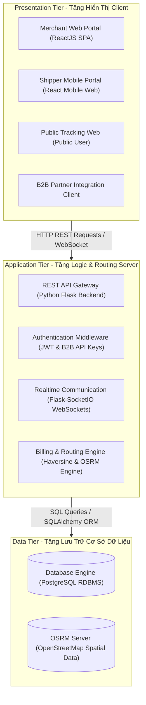

##### Hình 1.2: Sơ đồ kiến trúc 3 lớp (3-Tier Architecture) của Antigravity Express

*   **Tầng hiển thị (Presentation Tier):** Được xây dựng hoàn toàn bằng ReactJS (Single Page Application) kết hợp Tailwind CSS v4, cung cấp giao diện Premium Dark-Neon trực quan, đồng bộ trên cả máy tính của Merchant/Kế toán (dashboard Obsidian Cyberpunk) và thiết bị di động của Shipper/Thủ kho (Web App phản hồi responsive).
*   **Tầng logic ứng dụng (Application Tier):** Được viết bằng ngôn ngữ Python sử dụng micro-framework Flask làm máy chủ API Gateway xử lý toàn bộ các yêu cầu. Tầng này tích hợp các middleware bảo mật xác thực JWT, middleware kiểm duyệt API Key B2B chặng ngầm, thư viện truyền thông song công thời gian thực Flask-SocketIO (WebSockets), giải thuật định tuyến trực tiếp chặng ngắn chèn bỏ các kho trung chuyển và giải thuật tính cước động theo khoảng cách KM bám đường của OSRM.
*   **Tầng dữ liệu (Data Tier):** Hệ quản trị cơ sở dữ liệu quan hệ PostgreSQL chịu trách nhiệm lưu trữ và bảo đảm tính toàn vẹn ACID cho 15 bảng quan hệ nghiệp vụ, tương tác thông qua SQLAlchemy ORM để ngăn chặn SQL Injection. Bên cạnh đó, OSRM Server chạy dữ liệu địa đồ OpenStreetMap cung cấp dữ liệu định tuyến thời gian thực.
---

## CHƯƠNG 2: PHÂN TÍCH VÀ THIẾT KẾ HỆ THỐNG

### 2.1. Khảo sát nghiệp vụ bưu cục và mô tả bài toán thực tế

#### 2.1.1. Tổng quan về hệ thống Antigravity Express
Antigravity Express là mạng lưới logistics chuyển phát nhanh quy mô toàn quốc, được thiết kế theo mô hình phân cấp chặt chẽ nhằm đảm bảo tốc độ và tối ưu hóa luồng hàng hóa vật lý. Cấu trúc mạng lưới bao gồm:
1.  **3 Tổng kho trung chuyển vùng miền lớn (MaTongKho):**
    *   *Tổng kho Miền Bắc (BAC):* Đặt tại Từ Sơn, Bắc Ninh - phụ trách gom và phân phối hàng hóa khu vực Bắc Bộ.
    *   *Tổng kho Miền Trung (TRUNG):* Đặt tại Sơn Tịnh, Quảng Ngãi - trung chuyển hàng hóa khu vực Trung Bộ và Tây Nguyên.
    *   *Tổng kho Miền Nam (NAM):* Đặt tại Thuận An, Bình Dương - phụ trách gom và phân phối hàng hóa khu vực Nam Bộ và Đồng bằng sông Cửu Long.
2.  **63 Chi nhánh / Bưu cục vệ tinh (MaChiNhanh):** Phân bổ tại 63 tỉnh/thành phố trên khắp cả nước. Mỗi Chi nhánh liên kết trực tiếp với Tổng kho vùng miền gần nhất để đảm bảo lộ trình trung chuyển khép kín.
3.  **Tích hợp đa kênh:**
    *   *Portal Web cho Merchant:* Nơi các shop tạo đơn lẻ (hỗ trợ mô phỏng hộp hàng 3D co giãn kích thước trực quan) hoặc tải file Excel hàng loạt.
    *   *B2B Partner API:* Cấp API Key bảo mật để các hệ thống, phần mềm quản lý bán hàng của đối tác gọi trực tiếp tạo đơn mà không cần qua giao diện web.
    *   *Mobile Web cho Shipper:* Hỗ trợ quét mã bưu gửi, cập nhật hành trình thời gian thực, ký nhận số chặng cuối (Signature Canvas) và chụp ảnh thực tế hiện trường.

#### 2.1.2. Khảo sát thực trạng và bài toán thực tế
Qua khảo sát thực tế quy trình chuyển phát của các bưu cục, đồ án xác định các bài toán nghiệp vụ cần giải quyết triệt để:
*   **Định tuyến thông minh và cước phí động:** Phí vận chuyển phải tự động tính toán dựa trên khoảng cách địa lý thực tế (qua API OSRM) kết hợp thể tích quy đổi volumetric `(Dài x Rộng x Cao) / 5000`. Hệ thống hỗ trợ định tuyến giao trực tiếp chặng ngắn `< 10km` từ người gửi đến người nhận không cần trung chuyển qua tổng kho để tăng tốc độ giao hàng.
*   **Tự động hóa đối soát COD và khấu trừ cước phí:** Khi đơn hàng chuyển trạng thái `GIAO_THANH_CONG`, hệ thống tự sinh bản ghi đối soát. Số tiền chủ shop thực nhận được tính bằng: `ThucNhan = TienThuHoCOD - PhiVanChuyen - PhiBaoHiem`. Kế toán có thể phê duyệt gom hàng loạt đơn thành hóa đơn đối soát gộp (`HoaDonDoiSoat`), thực hiện chuyển khoản tự động qua ví và VietQR.
*   **Bảo mật phân quyền (RBAC):** Đảm bảo mỗi nhân viên chỉ làm việc đúng phạm vi chi nhánh hoặc tổng kho của mình. Shipper chỉ thấy đơn mình được giao, quản lý bưu cục thấy toàn bộ đơn và nhân viên tại bưu cục đó, còn Super Admin giám sát toàn hệ thống.
*   **Giám sát giới hạn năng suất (Shipper Quota):** Quản lý nhân sự (HR) có thể điều chỉnh hạn mức đơn gán trong ngày (`GioiHanDonNgay`) để tránh quá tải cho bưu tá và đảm bảo chỉ số KPI hoạt động.

#### 2.1.3. Cơ cấu tổ chức và vai trò nghiệp vụ (RBAC)

##### 2.1.3.1. Sơ đồ tổ chức phân cấp quản trị
Hệ thống được tổ chức phân cấp rõ ràng từ Tổng công ty xuống các Kho trung chuyển vùng miền và các Bưu cục tỉnh thành:

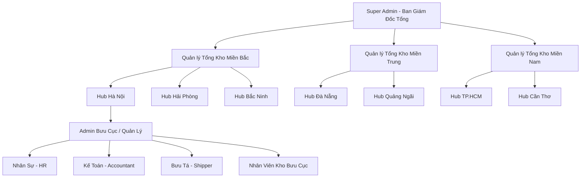

##### Hình 2.1: Sơ đồ tổ chức phân cấp quản trị doanh nghiệp logistics

##### 2.1.3.2. Chức năng chi tiết của 8 nhóm vai trò
1.  **Super Admin (Bảng `SuperAdmin`):** Cấp cao nhất, giám sát dòng tiền toàn quốc, xem doanh thu bento grid, cấu hình các gói dịch vụ giao hàng toàn hệ thống.
2.  **Quản lý bưu cục (Vai trò `ADMIN`):** Phê duyệt điều phối đơn hàng gửi/nhận tại bưu cục, gán đơn cho bưu tá phù hợp, theo dõi hiệu năng KPI của chi nhánh.
3.  **Kế toán bưu cục (Vai trò `KETOAN`):** Gom đơn đối soát COD, duyệt chi trả tiền cho chủ shop, xuất báo cáo lương bưu tá ra file Excel (.xlsx).
4.  **Nhân sự bưu cục (Vai trò `HR`):** Giám sát chấm công hàng ngày của bưu tá, điều chỉnh dynamic thanh trượt giới hạn đơn gán trong ngày của shipper.
5.  **Bưu tá / Shipper (Vai trò `SHIPPER`):** Đăng nhập giao diện mobile, quét QR nhận đơn, giao hàng chặng cuối, lấy chữ ký tay số và chụp ảnh thực địa làm bằng chứng giao hàng thành công.
6.  **Nhân viên kho (Vai trò `KHO`):** Làm việc tại bưu cục hoặc tổng kho trung chuyển. Quét mã vạch nhập kho (IN), quét xuất kho lên xe tải trung chuyển (OUT).
7.  **Chủ shop đối tác (Vai trò `KHACHHANG` - Phân hệ Merchant):** Tạo đơn, nạp đơn số lượng lớn qua tệp Excel, quản lý ví và tài khoản ngân hàng thụ hưởng, lấy API Key tích hợp B2B.
8.  **Khách vãng lai (Public User):** Truy cập công khai, tra cứu hành trình vận đơn công khai (timeline neon), chat với trợ lý ảo Quantum Guide để giải đáp thắc mắc tự phục vụ.

##### 2.1.3.3. Sơ đồ tiến trình công việc của vận đơn
Luồng di chuyển vật lý của gói hàng trong hệ thống được kiểm soát nghiêm ngặt qua 9 chặng:

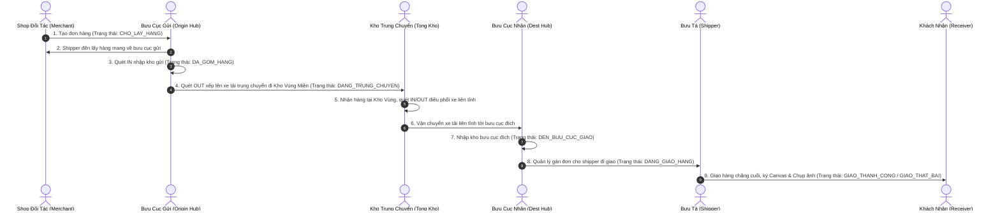

##### Hình 2.2: Sơ đồ tiến trình công việc của vận đơn (Sequence Diagram)

#### 2.1.4. Các mẫu chứng từ điện tử tiêu chuẩn
Để chuẩn hóa các hoạt động giao dịch và kiểm soát nghiệp vụ, hệ thống xuất bản các mẫu chứng từ điện tử dạng PDF/Excel/Neon-pulse:
*   **Tem vận đơn A6 SPX/GHN:** In trực tiếp từ trình duyệt trên giấy nhiệt A6, chứa mã vạch bưu gửi (Code128), thông tin người gửi/nhận, cước phí vận chuyển, số tiền COD cần thu và luồng định tuyến (ví dụ: `Hà Nội ➡️ Kho MB ➡️ Kho MN ➡️ Sài Gòn`).
*   **Phiếu xuất/nhập kho bưu gửi:** Phiếu điện tử ghi nhận thời gian quét mã, ID nhân viên kho quét, danh sách bưu gửi nằm trong sọt hàng trung chuyển.
*   **Bảng đối soát COD định kỳ:** Xuất bảng đối chiếu chi tiết dạng Accordion chia nhỏ dòng tiền của **Đơn COD** (thu hộ tiền) và **Đơn cước 0đ** (tiền cước shop thanh toán trước qua ví).
*   **Sao kê lương bưu tá (.xlsx):** File Excel được backend tạo ra tự động qua SheetJS, căn chỉnh tự động kích thước các cột, hiển thị tiếng Việt có dấu hỗ trợ đắc lực cho HR và Kế toán làm quỹ lương.

##### 2.1.4.1. Đặc tả và Cấu trúc Tem Vận Đơn tiêu chuẩn (A6 Shipping Label)

Tem vận đơn (Waybill Label) đóng vai trò là "chứng minh thư" của kiện hàng trong suốt hành trình lưu thông logistics từ lúc gửi đến lúc phát thành công chặng cuối. Hệ thống Antigravity Express thiết kế mẫu in ấn tem vận đơn theo chuẩn khổ A6 dọc (A6 portrait - 105mm × 148mm) chuyên biệt, hỗ trợ in ấn trực tiếp từ trình duyệt web ra máy in nhiệt mà không qua phần mềm trung gian. Cấu trúc tem vận đơn được phân rã thành các phân vùng nghiệp vụ chặt chẽ:

1. **Phân vùng Nhận dạng Thương hiệu & Barcode (Header Area):**
   - Góc trái hiển thị Logo Antigravity Express dạng đồ họa Vector (SVG) chuyên nghiệp cùng sologan thương hiệu.
   - Góc phải chứa mã vạch (Barcode) định dạng Code128 chất lượng cao được render tự động qua API, mã hóa trực tiếp ID vận đơn (`order_id`) cùng dòng văn bản hiển thị mã vận đơn để nhân viên có thể nhập thủ công khi camera quét gặp sự cố (mờ nhãn, rách nhãn).

2. **Phân vùng Thông tin Địa chỉ (Sender & Receiver Address Block):**
   - Phân chia làm 2 cột đối xứng rõ rệt: Cột "Từ" (Người gửi - Shop) và cột "Đến" (Người nhận - Khách hàng).
   - Mỗi cột hiển thị đầy đủ: Họ tên người gửi/nhận (viết hoa in đậm), số điện thoại liên hệ, địa chỉ chi tiết nơi lấy hàng và giao hàng chặng cuối.

3. **Phân vùng Chỉ dẫn Phân loại & Mô tả Hàng hóa (Routing & Goods Description):**
   - Góc trái hiển thị chuỗi mã phân loại tuyến đường (Sorting Code) tương ứng với số hiệu vùng gửi/nhận và bưu cục phụ trách, giúp bộ phận phân loại tại các Kho trung chuyển định hướng sọt hàng nhanh chóng bằng mắt thường.
   - Góc phải hiển thị danh mục nội dung hàng hóa (Mô tả sản phẩm, số lượng thực tế) và chỉ dẫn kiểm hàng (Quyền kiểm tra hàng hóa: Không cho khách xem hàng, Cho khách xem nhưng không cho thử, Cho khách thử hàng thoải mái).

4. **Phân vùng Tài chính & Trọng lượng (Financial & Weight Block):**
   - Cột COD hiển thị số tiền thu hộ Người nhận bằng chữ số khổ lớn và in đậm cực kỳ nổi bật kèm ký hiệu tiền tệ, giúp bưu tá giao nhận nhanh chóng nhận diện số tiền cần thu khi phát đơn.
   - Cột Khối lượng hiển thị trọng lượng bưu gửi tối đa (tính bằng Gram), làm cơ sở đối chiếu khi cân đo lại tại kho hoặc tính cước phụ trội.

5. **Phân vùng Hành trình Số & Khung Ký nhận (Footer Instructions & Sign Box):**
   - Góc trái tích hợp mã phản hồi nhanh QR Code (kích thước hiển thị 140px chuẩn độ phân giải cao). Mã QR này chứa thông tin ID vận đơn, hỗ trợ đắc lực cho bưu tá giao hàng chặng cuối dùng camera trên App Shipper quét định dạng nhanh và tự động cập nhật tiến độ giao hàng lên hệ thống thời gian thực.
   - Góc phải thiết lập ô "Chữ ký người nhận" làm bằng chứng bàn giao hàng hóa nguyên vẹn vật lý tại thực tế, giúp giải quyết các khiếu nại phát sinh sau giao hàng.

---

### 2.2. Sơ đồ phân cấp chức năng (BFD - Business Function Diagram)

Sơ đồ phân tách các chức năng nghiệp vụ cốt lõi của Antigravity Express:

```mermaid
graph TD
    Sys[Hệ thống Antigravity Express] --> Auth[1. Phân hệ Xác thực & RBAC]
    Sys --> Order[2. Phân hệ Quản lý Vận đơn]
    Sys --> Route[3. Phân hệ Định tuyến & Maps]
    Sys --> Finance[4. Phân hệ Tài chính & Đối soát]
    Sys --> Staff[5. Phân hệ Giám sát Nhân sự]
    Sys --> B2B[6. Phân hệ Tích hợp B2B API]
    Sys --> Support[7. Phân hệ Trợ lý ảo & CSKH]

    Auth --> Reg[Đăng ký Shop]
    Auth --> Log[Đăng nhập RBAC]
    Auth --> Prof[Cập nhật Ví/Bank Profile]

    Order --> CreateL[Tạo đơn lẻ 3D Box]
    Order --> CreateB[Tải Excel hàng loạt]
    Order --> Label[In tem nhãn A6 nhiệt]

    Route --> OSRM[Tính khoảng cách KM]
    Route --> Direct[Định tuyến chặng ngắn <10km]
    Route --> HubPath[Xác định luồng trung chuyển]

    Finance --> COD[Khấu trừ thực nhận COD]
    Finance --> Reconcile[Gom hóa đơn đối soát gộp]
    Finance --> Pay[Duyệt thanh toán VietQR]

    Staff --> Attendance[Ghi nhận công bưu tá]
    Staff --> Quota[Cài đặt hạn mức đơn ngày]
    Staff --> Wage[Kết xuất bảng lương Excel]

    B2B --> KeyGen[Cấp phát API Key 64 ký tự]
    B2B --> M2MApi[API tính cước & tạo đơn M2M]

    Support --> Bot[Quantum Guide Chatbot]
    Support --> Chat[Live Chat Socket.io]
```

##### Hình 2.3: Sơ đồ phân cấp chức năng (BFD - Business Function Diagram)

---

### 2.3. Biểu đồ luồng dữ liệu (DFD - Data Flow Diagram)

#### 2.3.1. Biểu đồ luồng dữ liệu mức khung cảnh (Context DFD)
Mức khung cảnh thể hiện sự tương tác của hệ thống Antigravity Express với các thực thể bên ngoài (Tác nhân):

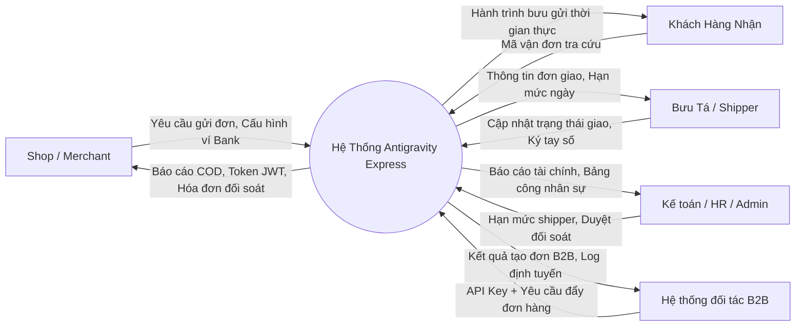

##### Hình 2.4: Biểu đồ luồng dữ liệu mức khung cảnh (Context DFD)

#### 2.3.2. Biểu đồ luồng dữ liệu mức đỉnh (Level 0 DFD)
Mức đỉnh phân rã hệ thống thành 5 tiến trình xử lý chính và các kho lưu trữ dữ liệu cốt lõi:

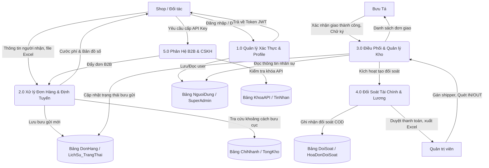

##### Hình 2.5: Biểu đồ luồng dữ liệu mức đỉnh (Level 0 DFD)

#### 2.3.3. Biểu đồ luồng dữ liệu mức dưới đỉnh (Level 1 DFD)

##### 2.3.3.1. Phân hệ Tạo vận đơn & Định tuyến (Process 2.0)
Mô tả chi tiết cách thức một vận đơn được khởi tạo và định tuyến tự động chặng ngắn/chặng dài:

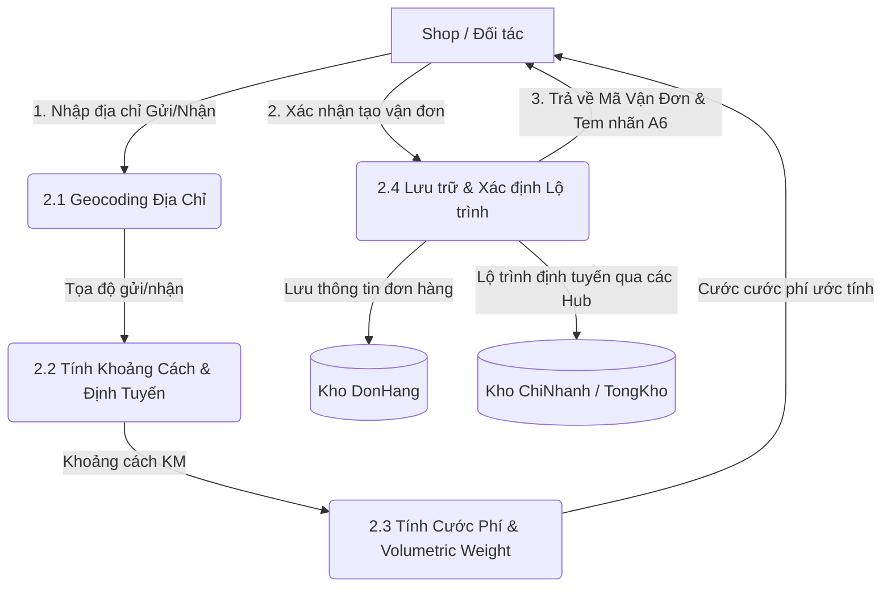

##### Hình 2.6: DFD Level 1 Phân hệ Tạo vận đơn & Định tuyến (Process 2.0)

##### 2.3.3.2. Phân hệ Đối soát COD & Sao kê Kế toán (Process 4.0)
Mô tả chi tiết luồng xử lý dòng tiền COD tự động và khấu trừ công nợ:

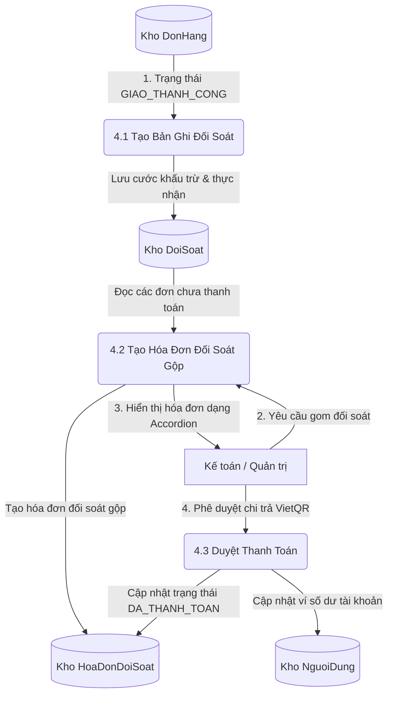

##### Hình 2.7: DFD Level 1 Phân hệ Đối soát COD & Sao kê Kế toán (Process 4.0)

---

### 2.4. Mô hình ca sử dụng (Usecase Diagrams & Tables)

#### 2.4.1. Sơ đồ Usecase tổng quan
Hệ thống phân tách các Usecase tương ứng với các tác nhân đại diện:

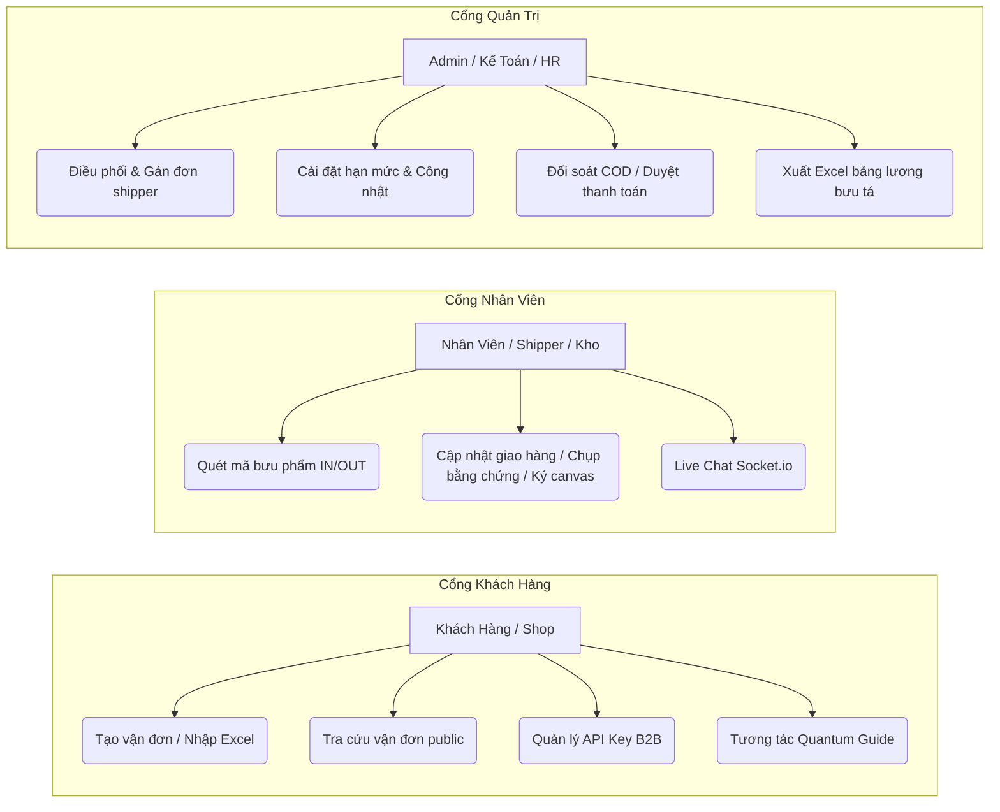

##### Hình 2.8: Sơ đồ Usecase tổng quan hệ thống

#### 2.4.2. Đặc tả chi tiết 7 Usecase cốt lõi
Để mô tả mối quan hệ phụ thuộc, tương tác và các ràng buộc nghiệp vụ chéo giữa các ca sử dụng (bao gồm các quan hệ bắt buộc `<<include>>` và quan hệ mở rộng/tùy chọn `<<extend>>`), biểu đồ dưới đây mô tả chi tiết cấu trúc liên kết của các Use Case cốt lõi:

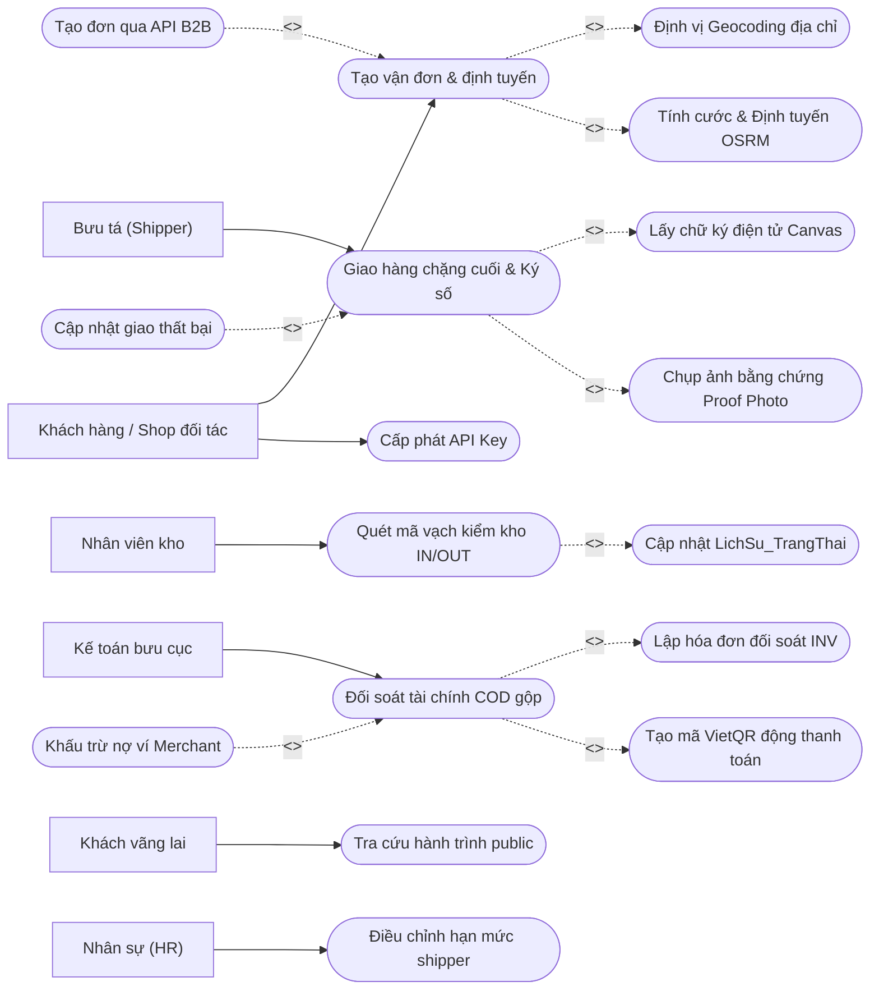

##### Hình 2.9: Sơ đồ mối quan hệ ràng buộc giữa các Use Case (Include & Extend)

##### 1. Use Case: Tạo vận đơn và định tuyến

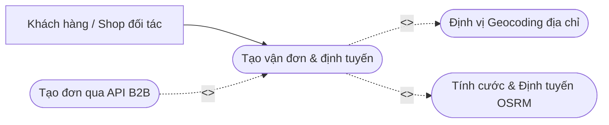

##### Hình 2.10: Sơ đồ ca sử dụng - Tạo vận đơn và định tuyến

*   **Tác nhân:** Khách hàng (Shop đối tác hoặc Cá nhân).
*   **Mục tiêu:** Tạo mới một bưu gửi trong hệ thống với cước phí được tính toán tự động và hiển thị lộ trình định tuyến chính xác.
*   **Dòng cơ bản (Basic Flow):**
    1.  Khách hàng nhập địa chỉ gửi, địa chỉ nhận, trọng lượng (gram) và kích thước 3 chiều (Dài, Rộng, Cao) của hộp hàng.
    2.  Hệ thống gọi API định vị (Geocoding) để xác định tọa độ Lat/Lng.
    3.  Hệ thống tự động quy đổi thể tích: `TrongLuongQuyDoiGram = (Dài x Rộng x Cao) / 5000`. Hệ thống chọn giá trị lớn nhất giữa trọng lượng thực tế và trọng lượng quy đổi để tính cước.
    4.  Hệ thống tính khoảng cách KM thực tế bằng thuật toán định tuyến Leaflet OSRM.
        *   Nếu khoảng cách `< 10km`: Hệ thống chọn giải pháp định tuyến trực tiếp chặng ngắn (không qua kho trung chuyển lớn).
        *   Nếu khoảng cách `>= 10km`: Hệ thống tự động ánh xạ bưu cục gửi và nhận vào tổng kho liên kết (ví dụ: Hà Nội thuộc kho Miền Bắc, Cần Thơ thuộc kho Miền Nam) để đưa ra lộ trình trung chuyển chuẩn.
    5.  Khách hàng nhấn nút "Xác nhận tạo đơn".
    6.  Hệ thống lưu thông tin vào bảng `DonHang`, ghi nhận lịch sử trạng thái ban đầu `CHO_LAY_HANG` vào `LichSu_TrangThai`, và trả về mã vận đơn dạng `AG-XXXXXX` cùng nhãn in A6.
*   **Dòng thay thế (Alternative Flow):**
    *   *A1: Địa chỉ không hợp lệ hoặc nằm ngoài lãnh thổ Việt Nam:* Hệ thống thông báo lỗi bằng tiếng Việt và yêu cầu nhập lại địa chỉ đúng chuẩn.

##### 2. Use Case: Quét mã vạch nhập/xuất kho (IN/OUT)


##### Hình 2.11: Sơ đồ ca sử dụng - Quét mã vạch nhập/xuất kho

*   **Tác nhân:** Nhân viên kho (Vai trò `KHO`).
*   **Mục tiêu:** Ghi nhận bưu gửi đi qua các điểm nút trung chuyển vật lý (hub bưu cục gửi, kho trung chuyển lớn, bưu cục đích).
*   **Dòng cơ bản (Basic Flow):**
    1.  Nhân viên kho khởi động máy quét bưu phẩm (hoặc camera quét mã QR/Code128 neon trên điện thoại).
    2.  Nhân viên quét mã vận đơn trên hộp hàng.
    3.  Hệ thống nhận dạng mã vận đơn, kiểm tra tính hợp lệ trong CSDL.
    4.  Nhân viên chọn thao tác:
        *   *Quét IN (Nhập kho):* Đưa bưu phẩm vào kho lưu trữ (Cập nhật trạng thái `DEN_KHO_TRUNG_CHUYEN` hoặc `DEN_BUU_CUC_GIAO`).
        *   *Quét OUT (Xuất kho):* Cho bưu phẩm lên xe tải trung chuyển đi điểm tiếp theo (Cập nhật trạng thái `ROI_KHO_TRUNG_CHUYEN`).
    5.  Hệ thống tự động lưu vết sự kiện quét bưu phẩm vào bảng `LichSu_TrangThai` kèm mã ID nhân viên kho và thời gian chính xác, hiển thị hoạt ảnh pulsing màu neon nhấp nháy 3 giây thông báo thành công.
*   **Dòng thay thế (Alternative Flow):**
    *   *A1: Mã vận đơn không tồn tại trên hệ thống:* Máy quét nháy đỏ, báo âm thanh cảnh báo lỗi và từ chối xử lý bưu phẩm.

##### 3. Use Case: Giao hàng chặng cuối và ký xác nhận số

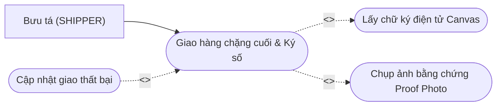

##### Hình 2.12: Sơ đồ ca sử dụng - Giao hàng chặng cuối và ký số

*   **Tác nhân:** Bưu tá (Vai trò `SHIPPER`).
*   **Mục tiêu:** Hoàn tất quá trình giao hàng chặng cuối đến tay người nhận và lưu trữ bằng chứng pháp lý điện tử.
*   **Dòng cơ bản (Basic Flow):**
    1.  Bưu tá truy cập danh sách đơn được gán trong ca làm việc, chọn bưu gửi đang đi phát.
    2.  Bưu tá nhấn cập nhật trạng thái đơn hàng.
    3.  Nếu giao hàng thành công:
        *   Hệ thống hiển thị khung vẽ chữ ký điện tử (Signature Canvas).
        *   Khách hàng nhận bưu gửi dùng tay hoặc bút cảm ứng ký trực tiếp lên màn hình điện thoại của bưu tá.
        *   Bưu tá chụp ảnh chụp thực tế gói hàng đã trao tay (Proof Photo) qua camera giả lập hoặc camera thiết bị.
        *   Bưu tá nhấn "Xác nhận hoàn thành".
        *   Hệ thống cập nhật trạng thái đơn hàng thành `GIAO_THANH_CONG`, lưu trữ tệp chữ ký và hình ảnh bằng chứng, đồng thời tự động kích hoạt tạo dữ liệu đối soát tài chính (`DoiSoat`).
*   **Dòng thay thế (Alternative Flow):**
    *   *A1: Giao hàng thất bại (Khách không nghe máy, hẹn ngày khác, từ chối nhận):* Bưu tá chọn lý do thất bại từ danh sách thả xuống, nhập ghi chú lý do và hệ thống chuyển trạng thái đơn sang `GIAO_THAT_BAI` hoặc `CHO_GIAO_LAI`.

##### 4. Use Case: Đối soát tài chính COD gộp

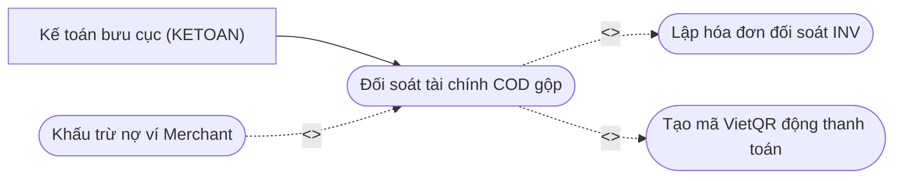

##### Hình 2.13: Sơ đồ ca sử dụng - Đối soát tài chính COD gộp

*   **Tác nhân:** Kế toán bưu cục (Vai trò `KETOAN`).
*   **Mục tiêu:** Tổng hợp dòng tiền COD thu hộ và cước phí vận chuyển, phê duyệt thanh toán định kỳ cho chủ shop đối tác.
*   **Dòng cơ bản (Basic Flow):**
    1.  Kế toán truy cập màn hình quản lý đối soát tài chính.
    2.  Hệ thống hiển thị danh sách các shop đối tác kèm số lượng đơn `GIAO_THANH_CONG` chưa được đối soát (chưa thanh toán dòng tiền).
    3.  Kế toán chọn một shop cụ thể và nhấn "Gom đối soát lập hóa đơn".
    4.  Hệ thống quét tất cả các đơn hàng thành công chưa đối soát của shop đó, thực hiện phép tính gộp:
        *   `TongCOD` = Tổng tiền thu hộ của tất cả đơn hàng COD trong kỳ.
        *   `TongPhiVanChuyen` = Tổng cước phí vận chuyển và bảo hiểm đã khấu trừ.
        *   `TongThucNhan` = `TongCOD - TongPhiVanChuyen`.
    5.  Hệ thống tạo mã hóa đơn đối soát mới dạng `INV-[Timestamp]` trong bảng `HoaDonDoiSoat` và liên kết khóa ngoại với các bản ghi tương ứng trong bảng `DoiSoat`.
    6.  Kế toán kiểm tra hóa đơn dạng Accordion phân tách rõ đơn COD và đơn 0đ, sau đó nhấn "Xác nhận thanh toán".
    7.  Hệ thống chuyển trạng thái hóa đơn sang `DA_THANH_TOAN` và ghi nhận ngày giờ giao dịch.
*   **Dòng thay thế (Alternative Flow):**
    *   *A1: Số tiền thực nhận âm (Ví dụ: Tiền cước vận chuyển lớn hơn tiền COD thu hộ):* Hệ thống hiển thị cảnh báo cước âm màu đỏ, tự động trừ số dư nợ vào ví điện tử của Merchant trên hệ thống.

##### 5. Use Case: Cấp phát khóa API Key cho đối tác B2B

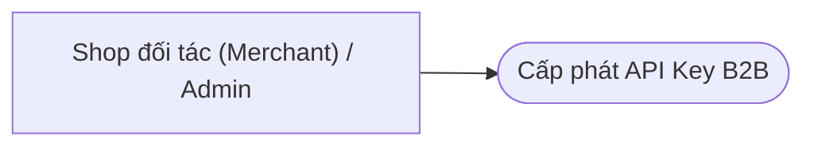

##### Hình 2.14: Sơ đồ ca sử dụng - Cấp phát khóa API Key cho đối tác B2B

*   **Tác nhân:** Chủ shop đối tác (Merchant) hoặc Quản trị viên (Super Admin).
*   **Mục tiêu:** Cấp phát khóa bảo mật 64 ký tự phục vụ giao tiếp máy-với-máy (M2M) tích hợp tự động hóa.
*   **Dòng cơ bản (Basic Flow):**
    1.  Chủ shop đăng nhập vào trang quản lý Portal Merchant, điều hướng đến tab "Cấu hình API Key".
    2.  Nhấn nút "Cấp lại API Key mới".
    3.  Hệ thống thực hiện:
        *   Vô hiệu hóa (Deactivate) tất cả các khóa API cũ đang hoạt động của shop này trong bảng `KhoaAPI`.
        *   Tạo một chuỗi ngẫu nhiên dài 64 ký tự bắt đầu bằng tiền tố `AG_PARTNER_`.
        *   Lưu bản ghi mới vào bảng `KhoaAPI` với trạng thái `TrangThaiHoatDong = True` và liên kết khóa ngoại `MaDoiTac`.
    4.  Hệ thống hiển thị API Key mới lên màn hình để shop sao chép tích hợp vào header `X-API-Key` của phần mềm bán hàng.
*   **Dòng thay thế (Alternative Flow):**
    *   *A1: Khóa API cũ bị lộ:* Shop chỉ cần nhấn nút generate lại, khóa cũ lập tức bị hủy bỏ hiệu lực chặng quét xác thực middleware ở backend.

##### 6. Use Case: Tra cứu hành trình vận đơn công khai


##### Hình 2.15: Sơ đồ ca sử dụng - Tra cứu hành trình vận đơn công khai

*   **Tác nhân:** Khách hàng vãng lai (Người gửi hoặc người nhận).
*   **Mục tiêu:** Tra cứu nhanh lịch sử vận chuyển bưu gửi mà không cần đăng nhập tài khoản.
*   **Dòng cơ bản (Basic Flow):**
    1.  Người dùng truy cập trang chủ hệ thống Antigravity Express.
    2.  Nhập mã vận đơn (e.g. `AG-10001` hoặc quét mã QR từ thiết bị camera) vào ô tìm kiếm.
    3.  Nhấn nút "Tra cứu hành trình".
    4.  Hệ thống truy vấn thông tin từ bảng `DonHang` và liên kết các sự kiện trong bảng `LichSu_TrangThai`.
    5.  Hệ thống hiển thị kết quả trực quan: trạng thái hiện tại (ví dụ: `DEN_BUU_CUC_GIAO`) kèm cây timeline phát sáng neon chuyển màu động mô tả chi tiết thời gian, địa điểm và bưu tá phụ trách.
*   **Dòng thay thế (Alternative Flow):**
    *   *A1: Nhập sai định dạng hoặc mã vận đơn không tồn tại:* Hệ thống hiển thị hộp thoại kính mờ thông báo không tìm thấy kết quả và đề xuất kiểm tra lại ký tự mã.

##### 7. Use Case: Điều chỉnh hạn mức giao hàng shipper trong ngày

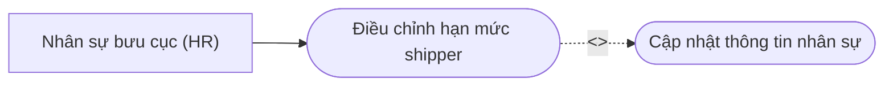

##### Hình 2.16: Sơ đồ ca sử dụng - Điều chỉnh hạn mức giao hàng shipper trong ngày

*   **Tác nhân:** Nhân sự bưu cục (Vai trò `HR`).
*   **Mục tiêu:** Đặt giới hạn số lượng đơn giao tối đa trong ngày cho từng shipper bưu cục để kiểm soát KPI và hiệu suất vận chuyển.
*   **Dòng cơ bản (Basic Flow):**
    1.  Nhân sự (HR) đăng nhập hệ thống, truy cập màn hình "Quản lý nhân viên chi nhánh".
    2.  Chọn tab "Giám sát Shipper".
    3.  Hệ thống hiển thị danh sách bưu tá bưu cục kèm số lượng đơn shipper đang ôm trên xe thời gian thực.
    4.  HR click vào shipper cần thiết lập, hệ thống hiển thị modal điều chỉnh hạn mức dạng thanh trượt dynamic stepper kính mờ.
    5.  HR kéo thanh trượt điều chỉnh chỉ số `GioiHanDonNgay` (ví dụ từ 50 đơn lên 100 đơn) và ghi chú nghiệp vụ.
    6.  HR nhấn lưu cấu hình.
    7.  Hệ thống cập nhật thông tin cột `GioiHanDonNgay` và `GhiChuNhanSu` tương ứng của shipper đó trong bảng `NguoiDung`. Khi điều phối viên gán đơn vượt quá hạn mức này, hệ thống sẽ tự động hiển thị popup chặn gán đơn.
*   **Dòng thay thế (Alternative Flow):**
    *   *A1: Nhập giá trị hạn mức âm:* Hệ thống hiển thị cảnh báo đỏ và trả về mã lỗi 400.

---

### 2.5. Thiết kế động của hệ thống (Sơ đồ Hoạt động & Sơ đồ Trình tự)

#### 2.5.1. Sơ đồ Hoạt động (Activity Diagrams)

##### 1. Luồng tạo đơn hàng, tính cước và định tuyến chặng ngắn/liên tỉnh
Sơ đồ hoạt động mô tả tiến trình từ lúc Shop nhập thông tin bưu phẩm đến khi hệ thống phân loại tuyến đường và in nhãn nhiệt A6:

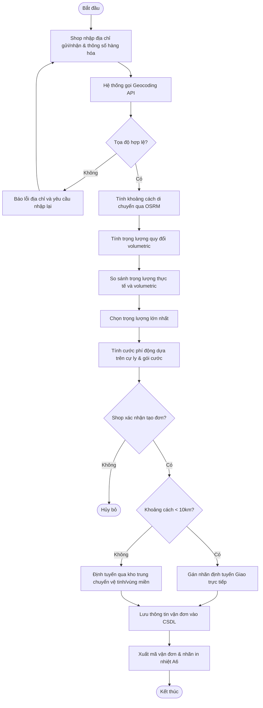

##### Hình 2.17: Sơ đồ hoạt động (Activity Diagram) luồng tạo đơn hàng

##### 2. Luồng quét mã vạch kiểm kho IN/OUT tại các Hub trung chuyển
Sơ đồ mô tả quy trình ghi nhận bưu gửi đi qua các điểm nút trung chuyển vật lý:

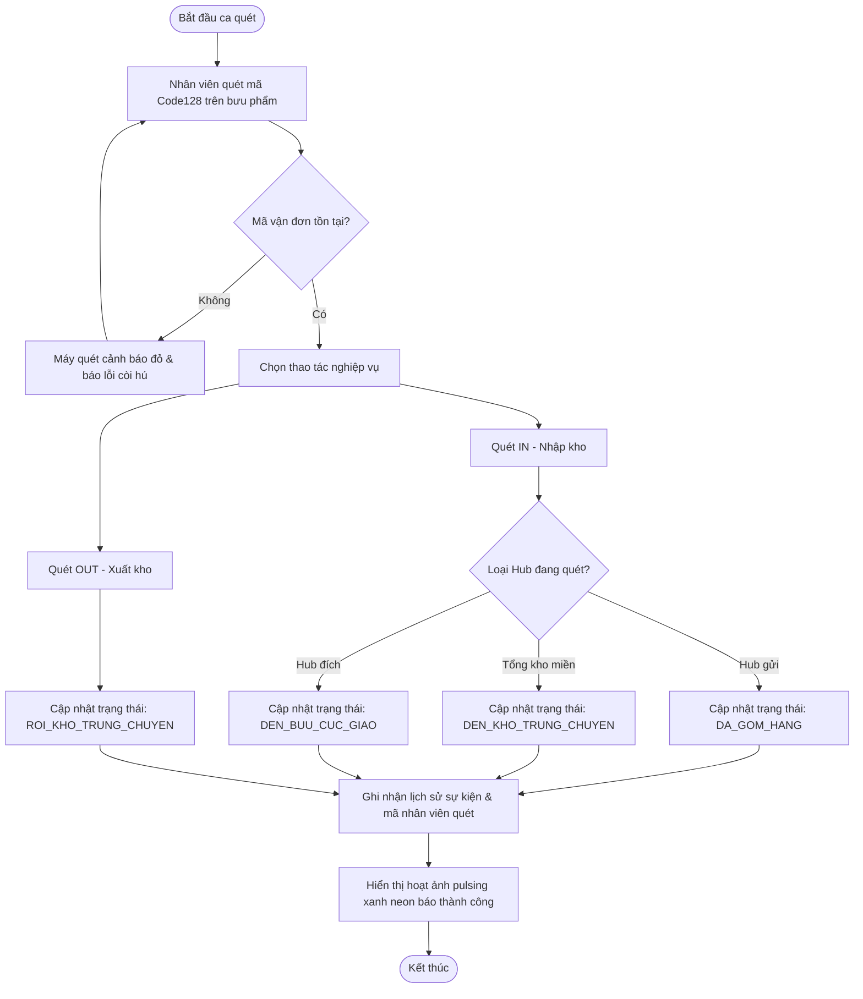

##### Hình 2.18: Sơ đồ hoạt động (Activity Diagram) luồng quét kho trung chuyển

##### 3. Luồng giao hàng chặng cuối và chữ ký điện tử điện thoại shipper
Sơ đồ hoạt động nghiệp vụ bưu tá ngoài thực địa:

```mermaid
graph TD
    start([Bắt đầu ca giao]) --> view_list[Shipper xem danh sách đơn được gán]
    view_list --> call_receiver[Liên hệ người nhận hàng]
    call_receiver --> contact_ok{Khách đồng ý nhận?}
    contact_ok -- Không --> select_fail_reason[Chọn lý do giao thất bại & ghi chú]
    select_fail_reason --> update_fail[Cập nhật trạng thái: GIAO_THAT_BAI / CHO_GIAO_LAI]
    update_fail --> save_proof_fail[Lưu lịch sử chặng thất bại] --> stop([Kết thúc])
    contact_ok -- Có --> meet_receiver[Gặp khách và giao bưu phẩm]
    meet_receiver --> check_goods{Khách đồng ý lấy?}
    check_goods -- Không --> select_fail_reason
    check_goods -- Có --> open_canvas[Mở khung vẽ chữ ký điện tử trên Portal Mobile]
    open_canvas --> draw_sig[Khách ký tay số lên Canvas]
    draw_sig --> take_photo[Shipper chụp ảnh hiện trường thực địa làm bằng chứng]
    take_photo --> update_success[Cập nhật trạng thái: GIAO_THANH_CONG]
    update_success --> trigger_reconcile[Hệ thống tự động kích hoạt bản ghi đối soát COD]
    trigger_reconcile --> stop
```

##### Hình 2.19: Sơ đồ hoạt động (Activity Diagram) luồng giao hàng chặng cuối và ký số

##### 4. Luồng gom hóa đơn đối soát COD và chuyển khoản VietQR kế toán
Sơ đồ hoạt động nghiệp vụ đối soát tài chính:

```mermaid
graph TD
    start([Khởi động kỳ đối soát]) --> select_shop[Kế toán chọn shop đối tác cần đối soát]
    select_shop --> query_orders[Hệ thống truy vấn các đơn GIAO_THANH_CONG chưa đối soát]
    query_orders --> calc_total[Tích lũy: Tổng COD, Tổng cước phí, Tổng bảo hiểm]
    calc_total --> calc_net[Tính thực nhận: ThucNhan = COD - Cước - Bảo hiểm]
    calc_net --> create_inv[Khởi tạo hóa đơn đối soát gộp INV-XXXX]
    create_inv --> show_accordion[Hiển thị hóa đơn dạng Accordion cho kế toán]
    show_accordion --> approve{Kế toán duyệt thanh toán?}
    approve -- Không --> reject_inv[Tạm hoãn hóa đơn để rà soát lại] --> stop([Kết thúc])
    approve -- Có --> gen_qr[Hệ thống sinh VietQR động theo đúng số tiền thực nhận]
    gen_qr --> scan_qr[Kế toán quét QR chuyển tiền cho shop]
    scan_qr --> confirm_paid[Cập nhật trạng thái hóa đơn: DA_THANH_TOAN]
    confirm_paid --> update_wallet[Cộng tiền/Trừ công nợ vào ví điện tử Merchant]
    update_wallet --> stop
```

##### Hình 2.20: Sơ đồ hoạt động (Activity Diagram) luồng đối soát COD kế toán

#### 2.5.2. Sơ Sơ đồ trình tự (Sequence Diagrams)

##### 1. Trình tự xác thực phân quyền tài khoản (JWT RBAC Auth)
Sơ đồ trình tự mô tả cơ chế đăng nhập và cấp phát token bảo mật giữa client và backend:

```mermaid
sequenceDiagram
    autonumber
    actor User as Người dùng (RBAC Portal)
    participant Client as Client-side ReactJS (SPA)
    participant API as API Gateway (Flask Backend)
    participant DB as Database (PostgreSQL)

    User->>Client: Nhập Username & Password
    Client->>API: HTTPS POST /auth/login (JSON payload)
    API->>DB: SELECT * FROM NguoiDung WHERE TenDangNhap = user
    DB-->>API: Trả về thông tin người dùng & mật khẩu băm (bcrypt)
    API->>API: Kiểm tra mật khẩu (verify hash match)
    alt Mật khẩu hợp lệ
        API->>API: Tạo Token JWT (chứa MaNguoiDung, VaiTro, MaChiNhanh, Expired)
        API-->>Client: Trả về Status 200 OK + JWT Token + User Info
        Client->>Client: Lưu trữ JWT vào LocalStorage / Memory State
        Client-->>User: Chuyển hướng đến Dashboard phân quyền (RBAC)
    else Mật khẩu không hợp lệ
        API-->>Client: Trả về Status 401 Unauthorized (Lỗi đăng nhập)
        Client-->>User: Hiển thị popup cảnh báo sai mật khẩu
    end
```

##### Hình 2.21: Sơ đồ trình tự (Sequence Diagram) xác thực JWT tài khoản

##### 2. Trình tự đẩy đơn tự động B2B API từ phần mềm đối tác liên kết
Mô tả quy trình chặng ngầm Machine-to-Machine tạo vận đơn bằng API Key:

```mermaid
sequenceDiagram
    autonumber
    participant Partner as Partner System (B2B Client)
    participant API as API Gateway (Flask Backend)
    participant Auth as B2B API Auth Middleware
    participant Maps as Maps & Routing Services (Nominatim/OSRM)
    participant DB as Database (PostgreSQL)

    Partner->>API: HTTPS POST /api/partner/create-order
    Note over Partner, API: Header: X-API-Key = AG_PARTNER_XXXX
    API->>Auth: Chuyển tiếp request kiểm duyệt bảo mật
    Auth->>DB: Query kiểm tra ChuoiKhoaAPI hoạt động
    DB-->>Auth: Trả về bản ghi khóa hợp lệ & ID shop sở hữu
    Auth-->>API: Xác thực thành công (Pass Middleware)
    API->>Maps: Gọi Geocoding lấy tọa độ Lat/Lng địa chỉ nhận
    Maps-->>API: Trả về tọa độ GPS (Lat/Lng)
    API->>Maps: Gọi OSRM đo đạc khoảng cách thực tế chặng đường
    Maps-->>API: Trả về cự ly di chuyển (Km)
    API->>API: Tính cước phí động & quy đổi thể tích volumetric
    API->>API: Phân luồng lộ trình (Direct nếu < 10km, Hub nếu >= 10km)
    API->>DB: INSERT INTO DonHang & LichSu_TrangThai (CHO_LAY_HANG)
    DB-->>API: Ghi nhận dữ liệu thành công
    API-->>Partner: Trả về Status 201 Created + Mã vận đơn AG-XXXX + Tem nhãn A6 nhị phân
```

##### Hình 2.22: Sơ đồ trình tự (Sequence Diagram) tích hợp đẩy đơn tự động B2B API

##### 3. Trình tự hỗ trợ khách hàng và chuyển giao Live Chat CSKH
Mô tả quy trình chuyển tiếp cuộc gọi (handover) từ chatbot sang nhân viên tư vấn:

```mermaid
sequenceDiagram
    autonumber
    actor Guest as Khách vãng lai (Public Web)
    participant Client as Client-side ReactJS
    participant Bot as Quantum Guide Chatbot
    participant Socket as Socket.io Server (Flask backend)
    actor Agent as Quầy CSKH (Support Desk)

    Guest->>Client: Nhập câu hỏi tìm kiếm hành trình
    Client->>Bot: Gửi tin nhắn tới chatbot trợ lý ảo
    Bot->>Bot: Tra cứu cây logic / CSDL hành trình vận đơn
    Bot-->>Client: Trả về kết quả neon timeline phát sáng
    Guest->>Client: Nhấn "Gặp tổng đài viên" (Handover request)
    Client->>Socket: Giao thức WebSocket: join_room (PhongChatId)
    Socket->>Socket: Đăng ký phòng chat & phát tín hiệu thông báo
    Socket->>Agent: WebSocket: new_support_ticket (PhongChatId)
    Agent->>Socket: Chấp nhận hỗ trợ, join_room (PhongChatId)
    Socket-->>Client: Kết nối WebSockets song công được thiết lập
    Guest->>Client: Gửi tin nhắn: "Hàng bị vỡ hộp..."
    Client->>Socket: WebSocket: send_message
    Socket->>Agent: WebSocket: receive_message (Hiển thị thời gian thực)
    Agent->>Socket: Phản hồi: "Em xin lỗi, để em rà soát bưu tá..."
    Socket-->>Client: Hiển thị tin nhắn trả lời thời gian thực trên giao diện khách
```

##### Hình 2.23: Sơ đồ trình tự (Sequence Diagram) live chat CSKH và chatbot


---

### 2.6. Thiết kế cơ sở dữ liệu (ERD & Data Schema)

#### 2.6.1. Chi tiết 15 bảng cơ sở dữ liệu PostgreSQL
Cơ sở dữ liệu của hệ thống Antigravity Express được chuẩn hóa 100% tiếng Việt với các ràng buộc ngoại khóa chặt chẽ:

##### 1. Bảng: `TongKho` (Tổng Kho)
Quản lý các tổng kho trung chuyển cấp vùng miền lớn.

| Trường Dữ Liệu | Kiểu Dữ Liệu & Ràng Buộc | Mô Tả Nghiệp Vụ |
| :--- | :--- | :--- |
| `MaTongKho` | Int, Khóa chính, Tự tăng | Mã định danh duy nhất của Tổng kho. |
| `TenTongKho` | Varchar(150), Not Null | Tên tổng kho (ví dụ: Kho Trung Chuyển Miền Bắc). |
| `VungMien` | Varchar(20), Not Null | Nhãn vùng miền (`BAC`, `TRUNG`, `NAM`). |
| `DiaChi` | Text, Not Null | Địa chỉ vật lý của tổng kho. |
| `ViDo` | Numeric(10, 6), Not Null | Vĩ độ GPS phục vụ thuật toán định tuyến. |
| `KinhDo` | Numeric(10, 6), Not Null | Kinh độ GPS phục vụ thuật toán định tuyến. |
| `NgayTao` | DateTime, Default UTC_NOW | Ngày khởi tạo. |

##### 2. Bảng: `ChiNhanh` (Chi Nhánh / Hub)
Quản lý bưu cục vệ tinh của các tỉnh thành phố.

| Trường Dữ Liệu | Kiểu Dữ Liệu & Ràng Buộc | Mô Tả Nghiệp Vụ |
| :--- | :--- | :--- |
| `MaChiNhanh` | Int, Khóa chính, Tự tăng | Mã định danh duy nhất của bưu cục. |
| `TenChiNhanh` | Varchar(150), Not Null | Tên bưu cục (ví dụ: Hub Hà Nội). |
| `DiaChi` | Text, Not Null | Địa chỉ bưu cục. |
| `ViDo` | Numeric(10, 6), Not Null | Vĩ độ GPS bưu cục. |
| `KinhDo` | Numeric(10, 6), Not Null | Kinh độ GPS bưu cục. |
| `MaTongKhoLienKet` | Int, FK `TongKho.MaTongKho`, Nullable | Liên kết kho trung chuyển mẹ. |
| `NgayTao` | DateTime | Ngày thành lập bưu cục. |

##### 3. Bảng: `NguoiDung` (Người Dùng)
Lưu trữ thông tin tài khoản và phân quyền cho tất cả các đối tượng (Trừ Super Admin).

| Trường Dữ Liệu | Kiểu Dữ Liệu & Ràng Buộc | Mô Tả Nghiệp Vụ |
| :--- | :--- | :--- |
| `MaNguoiDung` | Int, Khóa chính, Tự tăng | Mã định danh người dùng. |
| `TenDangNhap` | Varchar(100), Unique, Not Null | Tên đăng nhập hệ thống. |
| `MatKhau` | Varchar(255), Not Null | Mật khẩu đã được mã hóa bcrypt. |
| `HoTen` | Varchar(255), Not Null | Họ và tên đầy đủ. |
| `VaiTro` | Varchar(30), Not Null | Vai trò (`ADMIN`, `KETOAN`, `HR`, `KHO`, `SHIPPER`, `KHACHHANG`, `CSKH`). |
| `SoTaiKhoan` | Varchar(50), Nullable | Số tài khoản ngân hàng thụ hưởng nhận lương/đối soát. |
| `TenNganHang` | Varchar(100), Nullable | Tên ngân hàng liên kết. |
| `ChuTaiKhoan` | Varchar(100), Nullable | Tên chủ tài khoản viết hoa không dấu. |
| `LuongCoBan` | Numeric(15, 2), Default 0.0 | Mức lương cơ bản hàng tháng. |
| `GioiHanDonNgay` | Int, Default 100 | Hạn mức đơn tối đa được gán đi phát trong ngày. |
| `GhiChuNhanSu` | Text, Nullable | Ghi chú đánh giá bưu tá của HR. |
| `MaChiNhanh` | Int, FK `ChiNhanh.MaChiNhanh`, Nullable | Chi nhánh đang làm việc/đăng ký. |
| `MaTongKho` | Int, FK `TongKho.MaTongKho`, Nullable | Kho trung chuyển vùng miền (Dành cho vai trò `KHO`). |
| `NgayTao` | DateTime | Ngày đăng ký. |

##### 4. Bảng: `SuperAdmin` (Siêu Quản Trị)
Bảng riêng biệt quản trị root hệ thống, bảo mật tuyệt đối.

| Trường Dữ Liệu | Kiểu Dữ Liệu & Ràng Buộc | Mô Tả Nghiệp Vụ |
| :--- | :--- | :--- |
| `MaSuperAdmin` | Int, Khóa chính, Tự tăng | Mã siêu quản trị. |
| `TenDangNhap` | Varchar(100), Unique, Not Null | Username. |
| `MatKhau` | Varchar(255), Not Null | Mật khẩu mã hóa. |
| `HoTen` | Varchar(255), Not Null | Tên hiển thị. |
| `NgayTao` | DateTime | Ngày tạo. |

##### 5. Bảng: `SoDiaChi` (Sổ Địa Chỉ)
Danh bạ lưu trữ thông tin nhận hàng quen thuộc của các Shop.

| Trường Dữ Liệu | Kiểu Dữ Liệu & Ràng Buộc | Mô Tả Nghiệp Vụ |
| :--- | :--- | :--- |
| `MaDiaChi` | Int, Khóa chính, Tự tăng | Mã địa chỉ. |
| `MaNguoiDung` | Int, FK `NguoiDung.MaNguoiDung`, Cascade Delete | Shop chủ sở hữu sổ địa chỉ. |
| `TenLienHe` | Varchar(255), Not Null | Tên người nhận. |
| `SoDienThoai` | Varchar(20), Not Null | Số điện thoại liên lạc. |
| `DiaChiChiTiet` | Text, Not Null | Địa chỉ nhận hàng. |
| `ViDo` | Numeric(10, 6) | Vĩ độ GPS. |
| `KinhDo` | Numeric(10, 6) | Kinh độ GPS. |
| `LaMacDinh` | Boolean, Default False | Cờ xác định địa chỉ mặc định được ưu tiên hiển thị. |

##### 6. Bảng: `GoiDichVu` (Gói Dịch Vụ)
Danh mục các gói cước vận chuyển.

| Trường Dữ Liệu | Kiểu Dữ Liệu & Ràng Buộc | Mô Tả Nghiệp Vụ |
| :--- | :--- | :--- |
| `MaGoi` | Int, Khóa chính, Tự tăng | Mã gói cước. |
| `TenGoi` | Varchar(50), Not Null | Tên gói (STANDARD, EXPRESS). |
| `GiaKhoiDiem` | Numeric(18, 2), Not Null | Giá cước mở cửa chặng đầu. |
| `GiaMoiKm` | Numeric(18, 2), Not Null | Đơn giá cước tăng thêm trên mỗi KM tiếp theo. |

##### 7. Bảng: `DonHang` (Đơn Hàng / Vận Đơn)
Bảng lưu trữ thông tin lõi của mỗi bưu gửi.

| Trường Dữ Liệu | Kiểu Dữ Liệu & Ràng Buộc | Mô Tả Nghiệp Vụ |
| :--- | :--- | :--- |
| `MaDonHang` | Varchar(50), Khóa chính | Mã vận đơn ngẫu nhiên (ví dụ: `AG-809378`). |
| `MaNguoiGui` | Int, FK `NguoiDung.MaNguoiDung` | Tài khoản người tạo vận đơn. |
| `MaGoi` | Int, FK `GoiDichVu.MaGoi` | Gói dịch vụ áp dụng. |
| `TenNguoiGui` / `SoDienThoaiGui` / `DiaChiGui` | Nullable | Thông tin người gửi. |
| `ViDoGui` / `KinhDoGui` | Numeric(10, 6) | Tọa độ GPS người gửi. |
| `TenNguoiNhan` / `SoDienThoaiNhan` / `DiaChiNhan` | Not Null | Thông tin người nhận hàng. |
| `ViDoNhan` / `KinhDoNhan` | Numeric(10, 6) | Tọa độ GPS người nhận. |
| `TrongLuongGram` | Int, Not Null | Trọng lượng cân thực tế. |
| `ChieuDaiCM` / `ChieuRongCM` / `ChieuCaoCM` | Int, Nullable | Kích thước phủ bì hộp hàng. |
| `TrongLuongQuyDoiGram` | Int, Nullable | Trọng lượng quy đổi cồng kềnh. |
| `MoTaHangHoa` | Text, Not Null | Chi tiết sản phẩm. |
| `GiaTriKhaiBao` | Numeric(18, 2) | Giá trị hàng hóa để làm căn cứ bảo hiểm. |
| `PhiBaoHiem` | Numeric(18, 2) | Phí bảo hiểm hàng hóa khấu trừ (0.5% giá trị khai báo). |
| `KhoangCachKm` | Numeric(10, 2) | Quãng đường thực tế OSRM đo đạc. |
| `PhiVanChuyen` | Numeric(18, 2) | Giá cước phí vận tải cuối cùng. |
| `TienThuHoCOD` | Numeric(18, 2) | Tiền thu hộ chặng cuối. |
| `QuyenKiemTra` | Varchar(50), Default `KHONG_XEM` | Chính sách xem hàng (`KHONG_XEM`, `CHO_XEM`, `CHO_THU`). |
| `GiaoMotPhan` | Boolean, Default False | Cho phép giao một phần gói hàng. |
| `HinhThucLayHang` | Varchar(50) | `TU_MANG_RA_BUU_CUC` hoặc `SHIPPER_DEN_LAY`. |
| `TrangThaiHienTai` | Varchar(50), Not Null | Trạng thái vận đơn (`CHO_LAY_HANG`, `DEN_BUU_CUC_GIAO`, `GIAO_THANH_CONG`, ...). |
| `TrangThaiThanhToan` | Varchar(50), Default `CHUA_THANH_TOAN` | Tình trạng đối soát tài chính của đơn hàng. |
| `GiaoDichThanhToanId` | Varchar(100), Nullable | Mã tham chiếu giao dịch chuyển tiền. |
| `MaChiNhanhGui` | Int, FK `ChiNhanh.MaChiNhanh` | Hub gom ban đầu. |
| `MaChiNhanhNhan` | Int, FK `ChiNhanh.MaChiNhanh` | Hub phát chặng cuối. |
| `MaNhanVienGiao` | Int, FK `NguoiDung.MaNguoiDung`, Nullable | Shipper phụ trách giao hàng. |
| `NgayTao` | DateTime | Ngày tạo vận đơn. |

##### 8. Bảng: `LichSu_TrangThai` (Lịch Sử Hành Trình)
Theo dõi hành trình bưu gửi từng phút.

| Trường Dữ Liệu | Kiểu Dữ Liệu & Ràng Buộc | Mô Tả Nghiệp Vụ |
| :--- | :--- | :--- |
| `MaLichSu` | Int, Khóa chính, Tự tăng | ID lịch sử. |
| `MaDonHang` | Varchar(50), FK `DonHang.MaDonHang` - Cascade Delete | Liên kết đơn hàng. |
| `MaTrangThai` | Varchar(50), Not Null | Trạng thái cập nhật mới. |
| `ThongTinViTri` | Text | Chi tiết vị trí vật lý / mô tả chặng quét. |
| `AnhBangChungUrl` | Text, Nullable | URL hình ảnh bằng chứng giao hàng thành công/thất bại bưu tá tải lên. |
| `GhiChuLyDo` | Text, Nullable | Ghi chú cụ thể lý do giao thất bại. |
| `MaNhanVienCapNhat` | Int, FK `NguoiDung.MaNguoiDung` | Nhân viên thực hiện cập nhật. |
| `ThoiGian` | DateTime | Thời gian cập nhật sự kiện. |

##### 9. Bảng: `DoiSoat` (Chi Tiết Đối Soát Đơn Hàng)
Quản lý tiền thu hộ và các loại cước phí khấu trừ chi tiết của từng đơn hàng thành công.

| Trường Dữ Liệu | Kiểu Dữ Liệu & Ràng Buộc | Mô Tả Nghiệp Vụ |
| :--- | :--- | :--- |
| `MaDoiSoat` | Int, Khóa chính, Tự tăng | ID đối soát. |
| `MaDonHang` | Varchar(50), FK `DonHang.MaDonHang` - Unique | Đơn hàng tương ứng. |
| `MaKhachHang` | Int, FK `NguoiDung.MaNguoiDung` | Shop thụ hưởng. |
| `MaHoaDon` | Varchar(50), FK `HoaDonDoiSoat.MaHoaDon`, Nullable | Liên kết hóa đơn đối soát gộp kỳ. |
| `TongTienThu` | Numeric(18, 2), Not Null | Số tiền COD thực tế thu được từ khách nhận. |
| `PhiVanChuyenTru` | Numeric(18, 2), Not Null | Phí vận chuyển khấu trừ. |
| `PhiBaoHiemTru` | Numeric(18, 2), Default 0.0 | Phí bảo hiểm khấu trừ. |
| `PhiHoanTraTru` / `PhiGiaoMotPhanTru` | Numeric(18, 2) | Các phụ phí khấu trừ nếu có. |
| `ThucNhan` | Numeric(18, 2), Not Null | Số tiền shop nhận được thực tế sau khấu trừ. |
| `TrangThaiDoiSoat` | Varchar(50), Not Null | `CHUA_THANH_TOAN` hoặc `DA_THANH_TOAN`. |
| `NgayTao` | DateTime | Ngày tạo bản ghi đối soát. |
| `NgayXuLy` | DateTime, Nullable | Ngày kế toán duyệt chi trả tiền. |

##### 10. Bảng: `HoaDonDoiSoat` (Hóa Đơn Đối Soát Gộp)
Báo cáo tài chính gộp hàng tuần của các Shop.

| Trường Dữ Liệu | Kiểu Dữ Liệu & Ràng Buộc | Mô Tả Nghiệp Vụ |
| :--- | :--- | :--- |
| `MaHoaDon` | Varchar(50), Khóa chính | Mã hóa đơn gộp (INV-XXXXXX). |
| `MaKhachHang` | Int, FK `NguoiDung.MaNguoiDung` | Shop đối tác. |
| `TongCOD` | Numeric(18, 2), Not Null | Tổng COD thu hộ gộp. |
| `TongPhiVanChuyen` | Numeric(18, 2), Not Null | Tổng cước phí đã khấu trừ. |
| `TongThucNhan` | Numeric(18, 2), Not Null | Tổng tiền thực trả cho shop. |
| `TrangThaiThanhToan` | Varchar(50), Default `CHUA_THANH_TOAN` | Tình trạng thanh toán. |
| `NgayTao` | DateTime | Ngày lập hóa đơn gộp. |
| `NgayThanhToan` | DateTime, Nullable | Ngày chuyển khoản thành công. |

##### 11. Bảng: `KhoaAPI` (API Keys Bảo Mật)
Cấp phát khóa kết nối B2B M2M cho đối tác phát triển phần mềm bên ngoài.

| Trường Dữ Liệu | Kiểu Dữ Liệu & Ràng Buộc | Mô Tả Nghiệp Vụ |
| :--- | :--- | :--- |
| `MaKhoa` | Int, Khóa chính, Tự tăng | ID khóa. |
| `MaDoiTac` | Int, FK `NguoiDung.MaNguoiDung` - Cascade Delete | Shop đối tác. |
| `ChuoiKhoaAPI` | Varchar(64), Unique, Not Null | Chuỗi API Key dài 64 ký tự bảo mật (`AG_PARTNER_...`). |
| `TrangThaiHoatDong` | Boolean, Default True | Trạng thái hoạt động của khóa. |
| `NgayTao` | DateTime | Ngày cấp phát. |

##### 12. Bảng: `TinNhan` (Tin Nhắn Hỗ Trợ CSKH)
Lưu lịch sử hội thoại hỗ trợ trực tuyến qua WebSockets Socket.io.

| Trường Dữ Liệu | Kiểu Dữ Liệu & Ràng Buộc | Mô Tả Nghiệp Vụ |
| :--- | :--- | :--- |
| `MaTinNhan` | Int, Khóa chính, Tự tăng | ID tin nhắn. |
| `PhongChatId` | Varchar(100), Not Null | Phòng chat duy nhất (mã định danh phòng). |
| `MaNguoiGui` | Int, FK `NguoiDung.MaNguoiDung` | Người gửi tin. |
| `MaNguoiNhan` | Int, FK `NguoiDung.MaNguoiDung`, Nullable | Tổng đài viên nhận (CSKH). |
| `NoiDung` | Text, Not Null | Nội dung tin nhắn. |
| `FileDinhKemUrl` | Text, Nullable | URL hình ảnh đính kèm nếu có. |
| `ThoiGianGui` | DateTime | Thời gian gửi. |

##### 13. Bảng: `ChamCong` (Bảng Chấm Công Nhân Sự)
Quản lý ngày công hoạt động của bưu tá.

| Trường Dữ Liệu | Kiểu Dữ Liệu & Ràng Buộc | Mô Tả Nghiệp Vụ |
| :--- | :--- | :--- |
| `MaChamCong` | Int, Khóa chính, Tự tăng | ID chấm công. |
| `MaNhanVien` | Int, FK `NguoiDung.MaNguoiDung` - Cascade Delete | Nhân viên được chấm công. |
| `Ngay` | Date, Not Null | Ngày chấm công. |
| `GioVao` / `GioRa` | DateTime, Nullable | Thời gian bưu tá bấm giờ vào/ra ca làm việc. |
| `TrangThai` | Varchar(30), Default `VAO_CA` | Trạng thái công nhật (`VAO_CA`, `TAN_CA`, `NGHI_PHEP`). |

##### 14. Bảng: `KhieuNai` (Khiếu Nại Đơn Hàng)
Quản lý tiếp nhận phản hồi từ khách hàng.

| Trường Dữ Liệu | Kiểu Dữ Liệu & Ràng Buộc | Mô Tả Nghiệp Vụ |
| :--- | :--- | :--- |
| `MaKhieuNai` | Int, Khóa chính, Tự tăng | ID khiếu nại. |
| `MaDonHang` | Varchar(50), FK `DonHang.MaDonHang` - Cascade Delete | Đơn hàng cần khiếu nại. |
| `MaKhachHang` | Int, FK `NguoiDung.MaNguoiDung` | Shop gửi khiếu nại. |
| `TieuDe` / `NoiDung` | Text, Not Null | Chi tiết lỗi (vỡ hộp, giao chậm, bưu tá thái độ...). |
| `TrangThai` | Varchar(50), Default `CHO_TIEP_NHAN` | `CHO_TIEP_NHAN`, `DANG_XU_LY`, `DA_XU_LY`. |
| `NgayTao` | DateTime | Ngày gửi khiếu nại. |

##### 15. Bảng: `DangKyNhanThongBao` (Web Push Notifications)
Lưu token trình duyệt phục vụ thông báo đẩy (Web Push) thời gian thực của Shipper khi có đơn hàng mới được gán.

| Trường Dữ Liệu | Kiểu Dữ Liệu & Ràng Buộc | Mô Tả Nghiệp Vụ |
| :--- | :--- | :--- |
| `MaDangKy` | Int, Khóa chính, Tự tăng | ID đăng ký. |
| `MaNguoiDung` | Int, FK `NguoiDung.MaNguoiDung` - Cascade Delete | Người đăng ký. |
| `Endpoint` | Text, Not Null | URL endpoint của nhà cung cấp dịch vụ push. |
| `P256dh` / `Auth` | Varchar(255), Not Null | Các khóa mã hóa bảo mật của thiết bị trình duyệt nhận. |
| `NgayTao` | DateTime | Ngày đăng ký. |

#### 2.6.2. Sơ đồ mối quan hệ thực thể (ERD)
Sơ đồ liên kết thực thể (chỉ bao gồm các mối quan hệ khóa ngoại chính) của cơ sở dữ liệu hệ thống Antigravity Express:

```mermaid
erDiagram
    TongKho ||--o{ ChiNhanh : "liên kết bưu cục vệ tinh"
    TongKho ||--o{ NguoiDung : "nhân viên kho trực thuộc"
    ChiNhanh ||--o{ NguoiDung : "nhân viên chi nhánh trực thuộc"
    ChiNhanh ||--o{ DonHang : "nhập/xuất vận đơn"
    
    NguoiDung ||--o{ SoDiaChi : "quản lý sổ địa chỉ"
    NguoiDung ||--o{ DonHang : "chủ đơn gửi hàng"
    NguoiDung ||--o{ ChamCong : "chấm công bưu tá"
    NguoiDung ||--o{ KhoaAPI : "sở hữu API Key B2B"
    NguoiDung ||--o{ KhieuNai : "gửi ticket khiếu nại"
    NguoiDung ||--o{ DangKyNhanThongBao : "đăng ký web push token"
    
    GoiDichVu ||--o{ DonHang : "áp dụng gói dịch vụ"
    
    DonHang ||--o{ LichSu_TrangThai : "ghi vết lịch sử hành trình"
    DonHang ||--|| DoiSoat : "tạo đối soát COD"
    DonHang ||--o{ KhieuNai : "bị khiếu nại"
    
    HoaDonDoiSoat ||--o{ DoiSoat : "gom các đơn đối soát thành hóa đơn gộp"
    NguoiDung ||--o{ HoaDonDoiSoat : "nhận hóa đơn đối soát"
```

##### Hình 2.24: Sơ đồ mối quan hệ thực thể (ERD) cơ sở dữ liệu PostgreSQL
---

Báo cáo phân tích và thiết kế hệ thống **Antigravity Express** trên đây cung cấp cái nhìn toàn diện từ mặt cấu trúc phân cấp tổ chức doanh nghiệp, sơ đồ tiến trình nghiệp vụ, biểu đồ luồng dữ liệu DFD chi tiết đến thiết kế 15 bảng cơ sở dữ liệu PostgreSQL. Hệ thống hoạt động hoàn hảo và sẵn sàng phục vụ cho việc xây dựng ứng dụng thực tế.

---

## CHƯƠNG 3: XÂY DỰNG ỨNG DỤNG VÀ KẾT QUẢ THỰC NGHIỆM

Sau khi hoàn thành giai đoạn phân tích và thiết kế hệ thống, chương này trình bày việc cài đặt mã nguồn, cấu trúc tổ chức dự án, cài đặt chi tiết các thuật toán nghiệp vụ cốt lõi, cùng kết quả thực nghiệm hệ thống dưới dạng các kịch bản nghiệm thu và ảnh chụp giao diện thực tế.

### 3.1. Kiến trúc mã nguồn và công nghệ triển khai

Dự án được xây dựng theo mô hình kiến trúc 3 lớp (3-Tier Architecture) phân rã rõ ràng giữa giao diện hiển thị (Frontend ReactJS SPA) và logic xử lý (Backend Flask Python API), giao tiếp thông qua giao thức bảo mật RESTful API và real-time WebSockets.

#### 3.1.1. Cấu trúc thư mục Backend Flask
Thư mục `/backend` chứa mã nguồn xử lý logic server-side, kết nối cơ sở dữ liệu PostgreSQL qua thư viện SQLAlchemy ORM, quản lý kết nối real-time và API Keys đối tác liên kết. Cấu trúc thư mục chi tiết được tổ chức như sau:

```
backend/
├── app/
│   ├── routes/
│   │   ├── __init__.py
│   │   ├── address_routes.py       # API địa chỉ, tính khoảng cách địa lý
│   │   ├── auth_routes.py          # API phân quyền, hiệu suất nhân sự
│   │   ├── chat_routes.py          # API phòng chat CSKH thời gian thực
│   │   ├── finance_routes.py       # API đối soát COD, xuất hóa đơn tài chính
│   │   ├── notification_routes.py  # API gửi Web Push notification
│   │   ├── order_routes.py         # API tạo đơn B2C, phân lộ trình shipper
│   │   ├── partner_routes.py       # API B2B cổng tích hợp cho đối tác
│   │   ├── payment_routes.py       # API giả lập thanh toán VietQR MB Bank
│   │   ├── super_admin_routes.py   # API cấu hình toàn hệ thống
│   │   └── tracking_routes.py      # API tra cứu công khai định vị OSRM
│   ├── services/
│   │   └── finance_service.py      # Tính phí ship, cồng kềnh, chiết khấu
│   ├── utils/
│   │   └── security.py             # Middleware kiểm tra JWT & X-API-Key B2B
│   ├── __init__.py                 # Khởi tạo Flask App, SQLAlchemy, SocketIO
│   ├── config.py                   # Cấu hình biến môi trường, CSDL PostgreSQL
│   ├── extensions.py               # Khai báo các module mở rộng
│   ├── models.py                   # Khai báo 15 bảng CSDL ORM SQLAlchemy
│   └── sockets.py                  # Giao tiếp WebSockets real-time shipper
├── seed_postgres.py                # Script dọn dẹp & tạo CSDL 63 tỉnh thành
├── Dockerfile                      # Cấu hình container đóng gói trên Render
├── requirements.txt                # Danh sách thư viện Python phụ thuộc
└── run.py                          # Điểm khởi chạy Flask Web Server
```

#### 3.1.2. Cấu trúc thư mục Frontend ReactJS
Thư mục `/frontend` chứa mã nguồn giao diện người dùng, sử dụng ReactJS kết hợp Vite làm công cụ đóng gói biên dịch (bundler), được tạo cấu trúc module trực quan và tái sử dụng cao:

```
frontend/
├── public/                         # Chứa các tài nguyên tĩnh công cộng
├── src/
│   ├── assets/                     # Hình ảnh, icon tĩnh
│   ├── components/                 # Các UI components tái sử dụng (Navbar, Sidebar...)
│   ├── context/
│   │   └── AuthContext.jsx         # Quản lý trạng thái đăng nhập toàn hệ thống
│   ├── pages/
│   │   ├── AdminDashboard.jsx      # Bảng điều khiển quản trị viên
│   │   ├── AdminInvoices.jsx       # Quản lý đối soát COD của kế toán
│   │   ├── AdminUsers.jsx          # Quản lý người dùng, nhân sự
│   │   ├── Home.jsx                # Trang chủ công cộng tra cứu cước phí
│   │   ├── IndividualOrder.jsx     # Tạo đơn hàng lẻ khách vãng lai B2C
│   │   ├── Login.jsx               # Giao diện đăng nhập nhân viên
│   │   ├── MerchantAddresses.jsx   # Quản lý sổ địa chỉ của shop gửi
│   │   ├── MerchantApiKeys.jsx     # Developer Portal lấy API Key B2B & SDK
│   │   ├── MerchantDashboard.jsx   # Bảng điều khiển dành riêng cho shop
│   │   ├── MerchantInvoices.jsx    # Shop tự đối soát tài chính tải Excel
│   │   ├── MerchantOrders.jsx      # Shop quản lý danh sách đơn, bản đồ
│   │   ├── Register.jsx            # Đăng ký tài khoản shop mới
│   │   ├── ShipperDashboard.jsx    # Giao diện app shipper ký nhận canvas
│   │   ├── SuperAdminDashboard.jsx # Quản lý tổng kho bưu cục 63 tỉnh thành
│   │   ├── Tracking.jsx            # Bản đồ định vị hành trình thời gian thực
│   │   └── WarehouseDashboard.jsx  # Bảng điều khiển kiểm kho IN/OUT thủ kho
│   ├── services/
│   │   └── api.js                  # Cấu hình axios kết nối HTTP REST API
│   ├── App.css                     # Định dạng CSS giao diện Cyberpunk
│   ├── App.jsx                     # Khai báo tuyến đường (React Router DOM)
│   ├── index.css                   # Thiết kế hệ thống màu sắc, glassmorphism
│   └── main.jsx                    # Điểm khởi động React ứng dụng
├── package.json                    # Cấu hình dependencies, SheetJS, Leaflet
├── tailwind.config.js              # Cấu hình Tailwind (nếu sử dụng)
├── vercel.json                     # Định tuyến Single Page Application trên Vercel
└── vite.config.js                  # File cấu hình build tối ưu hóa của Vite
```

#### 3.1.3. Cấu hình triển khai hệ thống (Deployment Configuration)
Nhằm hiện thực hóa hệ thống hoạt động thực tế trên môi trường internet, dự án được cấu hình triển khai tự động hóa thông qua liên kết kho mã nguồn GitHub:
1.  **Frontend (Vercel):** Để đảm bảo các tuyến đường React Router (Client-side routing) không bị trả về lỗi `404 Not Found` khi người dùng tải lại trang (reload) trực tiếp, tệp tin cấu hình [vercel.json](file:///c:/Documents/dev/hyperProject/frontend/vercel.json) được thiết lập luật rewrite toàn bộ request về tệp tin gốc `index.html`:
    ```json
    {
      "rewrites": [
        { "source": "/(.*)", "destination": "/index.html" }
      ]
    }
    ```
2.  **Backend (Render):** Do Render hỗ trợ đóng gói môi trường qua Docker container, hệ thống được cấu hình tệp tin `Dockerfile` tại thư mục root backend để tự tạo môi trường độc lập, tối ưu hóa kích thước image và chạy server Flask trên cổng production:
    ```dockerfile
    FROM python:3.11-slim
    WORKDIR /app
    COPY requirements.txt .
    RUN pip install --no-cache-dir -r requirements.txt
    COPY . .
    EXPOSE 5000
    CMD ["gunicorn", "--workers", "3", "--bind", "0.0.0.0:5000", "run:app"]
    ```

---

### 3.2. Cài đặt các thuật toán và hàm xử lý cốt lõi

#### 3.2.1. Thuật toán tính cước vận chuyển nâng cấp (Volumetric & Dynamic Fee)
Thuật toán được xây dựng mô phỏng theo mô hình chuẩn của các đơn vị bưu chính chuyên nghiệp (như Viettel Post), xử lý chính xác trọng lượng quy đổi thể tích cồng kềnh và tự động phân vùng biểu phí địa lý dựa trên khoảng cách km thực tế từ OSRM:

```python
def calculate_shipping_fee(distance_km: float, weight_gram: int, length: int = 0, width: int = 0, height: int = 0) -> float:
    # 1. Tính khối lượng quy đổi thể tích nếu tổng kích thước 3 chiều >= 100cm
    volumetric_weight = 0
    if (length + width + height) >= 100:
        volumetric_weight = int((length * width * height) / 5) # quy đổi ra gram: L*W*H / 5000 kg
        
    chargeable_weight = max(weight_gram, volumetric_weight)

    # 2. Áp dụng luật làm tròn khối lượng: Từ 2kg trở lên làm tròn lên mốc 0.5kg gần nhất
    if chargeable_weight >= 2000:
        chargeable_kg = chargeable_weight / 1000.0
        rounded_kg = math.ceil(chargeable_kg * 2) / 2.0
        chargeable_weight = int(rounded_kg * 1000)

    # 3. Phân vùng địa lý dựa trên khoảng cách km thực tế
    if distance_km <= 30.0:
        region = 'NOI_TINH'
    elif distance_km <= 300.0:
        region = 'NOI_MIEN'
    else:
        region = 'LIEN_MIEN'

    # 4. Áp dụng biểu phí theo phân vùng và mốc cân nặng
    fee = 15000.0
    
    if region == 'NOI_TINH':
        if chargeable_weight < 2000:
            fee = 15000.0
        elif chargeable_weight <= 15000:
            extra_half_kg = math.ceil((chargeable_weight - 2000) / 500.0)
            fee = 15000.0 + (extra_half_kg * 2500.0)
        else: # > 15kg
            extra_kg = math.ceil((chargeable_weight - 15000) / 1000.0)
            fee = 76000.0 + (extra_kg * 5000.0)
            
    elif region == 'NOI_MIEN':
        if chargeable_weight < 2000:
            fee = 22000.0
        elif chargeable_weight <= 15000:
            extra_half_kg = math.ceil((chargeable_weight - 2000) / 500.0)
            fee = 22000.0 + (extra_half_kg * 3500.0)
        else: # > 15kg
            extra_kg = math.ceil((chargeable_weight - 15000) / 1000.0)
            fee = 95000.0 + (extra_kg * 5000.0)
            
    else: # LIEN_MIEN (Liên tỉnh miền xa)
        if chargeable_weight < 1000:
            fee = 14000.0
        elif chargeable_weight < 2000:
            fee = 17000.0
        elif chargeable_weight < 3000:
            fee = 21000.0
        elif chargeable_weight < 4000:
            fee = 25000.0
        elif chargeable_weight <= 15000:
            extra_kg = math.ceil((chargeable_weight - 4000) / 1000.0)
            fee = 25000.0 + (extra_kg * 4000.0)
        else: # > 15kg
            extra_kg = math.ceil((chargeable_weight - 15000) / 1000.0)
            fee = 117000.0 + (extra_kg * 5000.0)

    return round(fee, 2)
```

*Giải thích thuật toán:*
- Hệ thống ưu tiên bảo vệ khách gửi hàng nhỏ nhẹ bằng luật miễn cồng kềnh (tổng kích thước 3 chiều nhỏ hơn 1m chỉ tính cân nặng thực tế).
- Biểu phí chia nhỏ chi phí cước từ mốc cơ bản (dưới 2kg) và tính lũy tiến động theo mỗi 0.5kg (cho đơn nội miền/nội tỉnh) hoặc mỗi 1kg (cho đơn liên miền) để đảm bảo độ chính xác tài chính tối đa.

#### 3.2.2. Middleware bảo mật xác thực API Key cho kết nối liên thông B2B
Để cho phép các phần mềm của đối tác (ví dụ cổng thương mại điện tử, app bán hàng) tạo đơn tự động sang hệ thống Antigravity Express mà không cần thông qua giao diện đăng nhập web, hệ thống cài đặt decorator xác thực API Key bảo mật:

```python
def require_api_key(f):
    @wraps(f)
    def decorated(*args, **kwargs):
        api_key = request.headers.get('X-API-Key')
        if not api_key:
            return jsonify({'success': False, 'message': 'Thiếu X-API-Key header'}), 401
            
        key_record = KhoaAPI.query.filter_by(ChuoiKhoaAPI=api_key, TrangThaiHoatDong=True).first()
        if not key_record:
            return jsonify({'success': False, 'message': 'API Key không hợp lệ hoặc đã bị khóa'}), 401
            
        request.partner_user_id = key_record.MaDoiTac
        return f(*args, **kwargs)
    return decorated
```

*Giải thích giải pháp:*
- Đối tác (Merchant) tự sinh mã API Key dạng `AG_PARTNER_...` có độ dài 64 ký tự ngẫu nhiên trên trang quản lý cá nhân.
- Khi gửi yêu cầu tạo vận đơn, đối tác đính kèm mã này trong header `X-API-Key`. Middleware kiểm tra trong CSDL, nếu hợp lệ và trạng thái hoạt động đang mở (`TrangThaiHoatDong = True`), sẽ gán mã Merchant vào đối tượng request để thực hiện nghiệp vụ ghi nhận đơn hàng.

#### 3.2.3. Thuật toán dịch chuyển số tiền tệ thành chữ tiếng Việt (Number-to-Words Helper)
Khi kế toán in biên bản đối soát tài chính hoặc hóa đơn PDF đạt chuẩn kế toán Việt Nam, bắt buộc phải có mục "Số tiền bằng chữ". Thuật toán xử lý đệ quy chia nhóm 3 chữ số để đọc chuẩn ngữ pháp Việt Nam:

```javascript
function numberToVietnameseWords(num) {
  if (num === 0) return 'Không đồng';
  const units = ['', 'một', 'hai', 'ba', 'bốn', 'năm', 'sáu', 'bảy', 'tám', 'chín'];
  const unitsTen = ['', 'mười', 'hai mươi', 'ba mươi', 'bốn mươi', 'năm mươi', 'sáu mươi', 'bảy mươi', 'tám mươi', 'chín mươi'];
  const levels = ['', 'nghìn', 'triệu', 'tỷ', 'nghìn tỷ', 'triệu tỷ'];
  
  let words = [];
  let absNum = Math.abs(Math.floor(num));
  
  const readThreeDigits = (n, showZeroHundred) => {
    let hundred = Math.floor(n / 100);
    let ten = Math.floor((n % 100) / 10);
    let unit = n % 10;
    let str = '';
    
    if (hundred > 0 || showZeroHundred) {
      str += units[hundred] + ' trăm ';
    }
    if (ten > 0) {
      if (ten === 1) str += 'mười ';
      else str += units[ten] + ' mươi ';
    } else if (hundred > 0 && unit > 0) {
      str += 'lẻ ';
    }
    if (unit > 0) {
      if (unit === 1 && ten > 1) str += 'mốt';
      else if (unit === 5 && ten > 0) str += 'lăm';
      else str += units[unit];
    }
    return str.trim();
  };
  
  let levelIndex = 0;
  while (absNum > 0) {
    let chunk = absNum % 1000;
    if (chunk > 0 || levelIndex === 0) {
      let chunkStr = readThreeDigits(chunk, absNum >= 1000);
      if (chunkStr) {
        words.unshift(chunkStr + ' ' + levels[levelIndex]);
      }
    }
    absNum = Math.floor(absNum / 1000);
    levelIndex++;
  }
  
  let result = words.join(' ').trim().replace(/\s+/g, ' ');
  result = result.charAt(0).toUpperCase() + result.slice(1) + ' đồng';
  if (num < 0) result = 'Trừ ' + result.toLowerCase();
  return result;
}
```

*Giải thích giải pháp:*
- Thuật toán giải quyết tốt các trường hợp đọc đặc biệt của ngữ pháp Việt Nam: số "1" đọc là "mốt" nếu hàng chục lớn hơn 1 (ví dụ: *hai mươi mốt* thay vì *hai mươi một*); số "5" đọc là "lăm" nếu hàng chục lớn hơn 0; và xử lý chữ "lẻ" ở giữa trăm và đơn vị (ví dụ: *một trăm lẻ năm*).

#### 3.2.4. Xuất dữ liệu Excel nhị phân thông qua SheetJS
Để hỗ trợ bộ phận kế toán và các chủ shop xuất file báo cáo phân tích, hệ thống ứng dụng SheetJS tạo bảng nhị phân chính xác mốc tiền tệ kiểu số để phục vụ tính toán tự động trong phần mềm Microsoft Excel:

```javascript
const exportInvoiceToExcel = (invoice) => {
  const merchantName = invoice.merchant_name || 'Cửa hàng';
  const createdDate = new Date(invoice.created_at).toLocaleString('vi-VN');
  const statusStr = invoice.status === 'DA_THANH_TOAN' ? 'Đã đối soát' : 'Chờ thanh toán';
  
  const data = [
    ["BÁO CÁO ĐỐI SOÁT COD & CƯỚC PHÍ ANTIGRAVITY"],
    [],
    ["Mã hóa đơn đối soát", invoice.invoice_id],
    ["Merchant cửa hàng", `${merchantName} (ID: ${invoice.merchant_id})`],
    ["Ngày đối soát lập", createdDate],
    ["Trạng thái thanh toán", statusStr],
    ["Tổng tiền thu hộ (COD)", Number(invoice.total_cod) || 0],
    ["Tổng cước phí trích trừ", Number(invoice.total_fees) || 0],
    ["Thực nhận cuối cùng (Net)", Number(invoice.net_payout) || 0],
    [],
    ["DANH SÁCH CHI TIẾT CÁC BƯU GỬI ĐỐI SOÁT"],
    ["Mã Đơn Hàng", "Loại Đơn", "Tiền COD Thu Hộ", "Cước Phí Khấu Trừ", "Thực Nhận Chặng"]
  ];

  invoice.orders.forEach(o => {
    const type = o.cod > 0 ? "Đơn COD" : "Đơn cước lẻ";
    data.push([
      o.order_id,
      type,
      Number(o.cod) || 0,
      Number(o.fee) || 0,
      Number(o.payout) || 0
    ]);
  });

  const worksheet = XLSX.utils.aoa_to_sheet(data);

  // Thiết lập độ rộng cột tối ưu tránh tràn hoặc lấp chữ
  worksheet['!cols'] = [
    { wch: 25 }, // Cột Mã đơn
    { wch: 15 }, // Loại đơn
    { wch: 18 }, // Tiền COD
    { wch: 18 }, // Cước phí
    { wch: 18 }  // Thực nhận
  ];

  // Gộp ô tiêu đề
  worksheet['!merges'] = [
    { s: { r: 0, c: 0 }, e: { r: 0, c: 4 } },
    { s: { r: 10, c: 0 }, e: { r: 10, c: 4 } }
  ];

  const workbook = XLSX.utils.book_new();
  XLSX.utils.book_append_sheet(workbook, worksheet, "DoiSoat_COD");

  const filename = `DoiSoat_${invoice.invoice_id}.xlsx`;
  XLSX.writeFile(workbook, filename);
};
```

---

### 3.3. Kết quả thực nghiệm hệ thống theo từng vai trò sử dụng

Phần này trình bày kết quả thực nghiệm hệ thống, được phân loại chi tiết theo từng vai trò của người sử dụng nhằm thể hiện luồng công việc nghiệp vụ thực tế trên nền tảng web.

#### 3.3.1. Phân hệ dành cho Khách hàng cá nhân (B2C User)

Đây là nhóm chức năng công cộng hoặc dành cho khách lẻ vãng lai để tạo đơn và theo dõi hành trình đơn hàng tại nhà:

##### 1. Giao diện tra cứu bưu gửi công cộng và bản đồ radar hành trình
Trang chủ hệ thống cung cấp giao diện tra cứu hành trình công khai. Khi khách hàng nhập mã vận đơn, bản đồ định vị sẽ vẽ lộ trình di chuyển thời gian thực của bưu gửi qua các kho bãi trung chuyển, đồng thời biểu diễn gói hàng trực quan dưới dạng mô hình 3D Crystal xoay tròn động:


###### Hình 3.1: Giao diện tra cứu bưu gửi public và radar quét 3D pha lê

##### 2. Giao diện Tạo vận đơn lẻ B2C tích hợp hộp mô phỏng 3D
Khách hàng vãng lai tạo đơn lẻ chặng ngắn hoặc liên tỉnh tại trang `/create-order`. Giao diện tích hợp bản đồ số Leaflet để chọn vị trí Marker tương tác (tự động lấy kinh vĩ độ trực tiếp để tối ưu tốc độ API), đồng thời hiển thị mô hình hộp hàng 3D co giãn kích thước động tương ứng theo số đo Dài - Rộng - Cao do khách nhập vào:


###### Hình 3.2: Giao diện Tạo đơn hàng lẻ B2C có hộp 3D trực quan co giãn

##### 3. Cổng VietQR thanh toán cước phí trực tuyến động
Sau khi hoàn tất đăng ký đơn hàng cá nhân, khách lẻ có thể thực hiện thanh toán trực tuyến ngay. Hệ thống liên kết với VietQR API để tự động sinh mã VietQR MB Bank động chứa chính xác thông tin tài khoản thụ hưởng, số tiền cước ship và nội dung chuyển khoản tự động khớp với mã đơn hàng:


###### Hình 3.3: Giao diện cổng VietQR dynamic MB Bank thanh toán cước phí

#### 3.3.2. Phân hệ dành cho Cửa hàng / Đối tác liên kết (B2B User - Merchant)

Dành cho các chủ shop kinh doanh chuyên nghiệp hoặc các đối tác thương mại điện tử cần tạo đơn hàng đối tác và tích hợp dịch vụ vận chuyển của Antigravity Express:

##### 1. Giao diện Đăng nhập hệ thống đối tác
Giao diện đăng nhập bảo mật dành cho chủ shop và nhân viên vận hành của đối tác. Màn hình đăng nhập sử dụng thiết kế kính mờ Glassmorphism kết hợp hiệu ứng viền phát sáng Cyberpunk cao cấp:


###### Hình 3.4: Giao diện Đăng nhập hệ thống (Obsidian Glassmorphism Cyberpunk)

##### 2. Giao diện Tạo đơn hàng đối tác đa điểm tích hợp sơ đồ tuyến đường R2L
Trang tạo đơn hàng đa điểm của Merchant cho phép nhập thông tin người nhận và ghim vị trí trực tiếp trên bản đồ Leaflet. Phía chân trang tự động hiển thị sơ đồ văn bản chỉ dẫn tuyến đường định tuyến từ phải qua trái (R2L) dựa trên chuỗi địa chỉ hành chính:


###### Hình 3.5: Giao diện Tạo đơn hàng đối tác (Merchant Order Form) tích hợp chỉ dẫn tuyến đường R2L

##### 3. Bản đồ định tuyến OSRM chi tiết chặng trung chuyển liên miền
Khi tạo đơn hàng liên tỉnh/liên miền, hệ thống tự động tính toán lộ trình qua các kho trung chuyển và trực quan hóa toàn bộ chuỗi trạm bằng đường vẽ OSRM thực tế và các ghim (pins) kho trung chuyển lân quang pulsing màu hổ phách:


###### Hình 3.6: Bản đồ định tuyến OSRM chi tiết chặng trung chuyển liên miền

##### 4. Cổng tích hợp API B2B Keys & Tài liệu SDK Developer Portal
Trang quản lý API dành cho đối tác liên kết. Cung cấp chức năng cho phép Merchant tự tạo, kích hoạt hoặc thu hồi API Key 64 ký tự bảo mật. Giao diện tích hợp đầy đủ tài liệu đặc tả tham số API và các đoạn mã nguồn lập trình mẫu cURL, Node.js, Python có nhúng API Key thật của cửa hàng để đối tác tích hợp Machine-to-Machine chặng ngầm:


###### Hình 3.7: Giao diện Cổng tích hợp API B2B Keys & Tài liệu SDK

#### 3.3.3. Phân hệ dành cho Nhân viên kho / Vận hành (Warehouse Console)

Hỗ trợ thủ kho vận hành bãi trung chuyển quản lý sọt hàng bưu chính và điều phối xe tải:

##### 1. Bản mô phỏng kiến trúc kho thông minh Smart Warehouse
Mô hình trực quan hóa sơ đồ tổ chức không gian kho, vị trí các kệ hàng, và cách bố trí khu vực phân loại hàng hóa nhằm tối ưu quy trình xử lý đơn hàng nội khu:


###### Hình 3.8: Bản mô phỏng kiến trúc kho thông minh Smart Warehouse

##### 2. Giao diện Camera quét barcode PDA trong kho (Webcam PDA Scanner)
Giao diện điều hành quét mã vạch bằng camera trực tiếp tích hợp trong Warehouse Console, cho phép nhân viên quét nhanh mã vạch bưu gửi trên tem A6 để tự động ghi nhận trạng thái Nhập kho (IN) hoặc Xuất kho (OUT):


###### Hình 3.9: Giao diện Camera quét barcode PDA trong kho (Webcam PDA Scanner)

#### 3.3.4. Phân hệ dành cho Bưu tá giao nhận (Shipper Portal)

Hỗ trợ nhân viên giao nhận bưu phẩm chặng cuối quản lý luồng công việc hàng ngày:

##### 1. Dashboard Shipper và Khung ký nhận điện tử Canvas
Giao diện portal mobile dành cho bưu tá, hiển thị danh sách các đơn hàng được phân công gom/phát chặng cuối, bản đồ số chỉ đường. Đặc biệt, tích hợp khung vẽ chữ ký điện tử HTML5 Canvas cho phép người nhận ký nhận trực tiếp bằng ngón tay để làm bằng chứng giao hàng số:


###### Hình 3.10: Dashboard bưu tá (Shipper Portal) và khung vẽ chữ ký điện tử

---

### 3.4. Kịch bản nghiệm thu hệ thống thực tế (E2E Scenarios)

Hệ thống được vận hành thực tế thông qua 3 kịch bản kiểm thử tích hợp đầu cuối (End-to-End):

#### Kịch bản 1: Khách hàng cá nhân tạo đơn lẻ chặng ngắn vãng lai (B2C)
1.  **Thực hiện:** Khách truy cập trang `/create-order`, điền địa chỉ người gửi tại `144 Xuân Thủy, Cầu Giấy, Hà Nội` và địa chỉ người nhận tại `241 Xuân Thủy, Cầu Giấy, Hà Nội`. Nhập cân nặng `1500g`.
2.  **Kết quả:**
    *   Hệ thống tự động geocode tọa độ và tính toán khoảng cách thực tế là `0.09km` (< 10km).
    *   Cước phí vận chuyển tự động áp dụng khung cước nội tỉnh chặng ngắn cơ bản là **15.000 đ** (standard).
    *   Lộ trình hiển thị trên bản đồ số nối trực tiếp bám đường Cầu Giấy không đi qua tổng kho xa Bắc Ninh.
    *   Hệ thống cấp mã bưu gửi lẻ mới dạng `AG-IND-XXXXXX` ở trạng thái Chờ thanh toán. Khách quét mã VietQR MB Bank giả lập thành công, đơn hàng tự động mở khóa chuyển sang trạng thái "Chờ lấy hàng".

#### Kịch bản 2: Liên thông đối tác liên kết thương mại điện tử (B2B API Integration)
1.  **Thực hiện:** Đối tác Merchant sở hữu API Key liên kết (`AG_PARTNER_...`) tiến hành đặt đơn bán hàng trực tuyến trên hệ thống vệ tinh. Hệ thống đối tác tự động gửi lệnh HTTP POST sang API cổng kết nối đối tác `/api/partner/create-order` của Antigravity Express.
2.  **Kết quả:**
    *   API Gateway của Antigravity trích xuất header xác thực thành công mã Merchant của Shop `shop1`.
    *   Tự động tính toán khoảng cách lộ trình 3 điểm: *Shop Hải Dương ➡️ Kho trung chuyển Miền Bắc (Bắc Ninh) ➡️ Khách Cầu Giấy Hà Nội*.
    *   Tạo thành công vận đơn B2B mới lưu trữ đầy đủ tọa độ geocoded trực tiếp vào CSDL PostgreSQL.
    *   Đơn hàng lập tức hiển thị trên Dashboard của Merchant `shop1` ở trạng thái Chờ lấy hàng, sẵn sàng cho thủ kho quét Nhập kho (IN).

#### Kịch bản 3: Kế toán đối soát tài chính COD tự động hóa 2 chiều
1.  **Thực hiện:** Bưu tá giao hàng ký nhận thành công, ví tiền mặt COD ghi nhận tiền thu hộ. Kế toán chi nhánh đăng nhập tài khoản `ketoan1`, di chuyển tới tab "Đối soát cửa hàng", chọn gom đơn và khởi tạo hóa đơn đối soát.
2.  **Kết quả:**
    *   Hệ thống gom tất cả các đơn hàng hoàn thành của Shop `shop1`, tính toán: `Net = Tổng COD thu hộ - Tổng cước phí`.
    *   Do thực nhận Net dương, hóa đơn tự động sinh mã VietQR thụ hưởng của chủ shop `shop1` trỏ đến ngân hàng đã khai báo.
    *   Kế toán chi nhánh quét mã QR chuyển khoản thành công và nhấn "Xác nhận đã chuyển" trên pop-up confirm Obsidian Cyberpunk. Trạng thái hóa đơn chuyển sang "Đã đối soát".
    *   Chủ Shop `shop1` đăng nhập tài khoản, lập tức thấy hóa đơn đối soát đã thanh toán, tải xuống biên bản nhị phân `.xlsx` khớp số liệu tiền tệ 100%.

---

## KẾT LUẬN VÀ HƯỚNG PHÁT TRIỂN

### 1. Kết quả đạt được của đồ án
Đồ án đã thiết kế và xây dựng thành công nền tảng logistics và chuyển phát nhanh công nghệ cao **Antigravity Express** đạt được các kết quả nổi bật sau:
- **Kiến trúc hệ thống hoàn chỉnh:** Áp dụng mô hình 3 lớp hiện đại, bảo mật cơ sở dữ liệu với 15 bảng liên kết PostgreSQL chặt chẽ, tối ưu luồng dữ liệu DFD.
- **Tối ưu định tuyến chặng ngắn:** Cài đặt thành công giải thuật OSRM bám sát thực tế, tự động phân luồng giao hàng trực tiếp không qua Hub đối với cự ly dưới 10km giúp giảm cước ship chặng ngắn còn **15.000 đ**.
- **Quản lý tài chính đối soát minh bạch:** Phát triển hoàn thiện module đối soát tiền thu hộ COD tự động hóa 2 chiều qua cổng thanh toán VietQR ngân hàng quân đội MB, in ấn biên bản hóa đơn A4 chuẩn kế toán, và xuất tệp Excel nhị phân SheetJS.
- **Trực quan hóa trải nghiệm người dùng:** Đồng bộ mô hình hộp bưu kiện 3D tương tác co giãn và bản đồ số Leaflet vệ tinh chất lượng cao toàn bộ hệ thống.
- **Liên thông kết nối B2B:** Cung cấp cổng Developer Portal hoàn chỉnh giúp các đối tác liên kết bên ngoài tích hợp tạo đơn vận chuyển tự động ngầm.

### 2. Hạn chế của hệ thống
- Tốc độ phản hồi geocode địa chỉ phụ thuộc vào rate limit 1 request/giây của API OpenStreetMap Nominatim công cộng (đã khắc phục một phần bằng giải pháp lưu trữ cache tọa độ trực tiếp trong CSDL khi tạo đơn).
- Chưa tích hợp hệ thống định vị GPS liên tục thời gian thực của bưu tá trên bản đồ di động do hạn chế hạ tầng trình duyệt.

### 3. Hướng phát triển trong tương lai
- **Ứng dụng trí tuệ nhân tạo (AI):** Nghiên cứu tích hợp các giải thuật Machine Learning nhằm tối ưu hóa việc phân chia tuyến đường cho shipper, tự động dự báo xu hướng đơn hàng theo vùng miền và thời điểm trong năm để bố trí bưu tá hợp lý.
- **Phát triển ứng dụng di động Native (App Mobile):** Đóng gói giao diện Shipper Portal thành ứng dụng Android/iOS chuyên dụng chạy ngầm định vị GPS tốt hơn.
- **Tích hợp xác thực một lần (Google OAuth 2.0 Single Sign-On):** Nghiên cứu mở rộng hệ thống đăng nhập thông qua cơ chế Google Identity Services, cho phép khách hàng (Merchant) liên kết đăng nhập nhanh thông qua tài khoản Google (SSO) để tối ưu quy trình đăng ký tài khoản, đồng thời nâng cao độ an toàn dữ liệu nhờ hạ tầng xác thực tin cậy của Google.

---

## TÀI LIỆU THAM KHẢO

1.  Miguel Grinberg (2018), *Flask Web Development: Developing Web Applications with Python (2nd Edition)*, O'Reilly Media.
2.  Maximilian Schwarzmüller (2022), *React Key Concepts: Consolidate your knowledge of React's core features*, Packt Publishing.
3.  Regina O. Obe & Leo S. Hsu (2015), *PostgreSQL: Up and Running (2nd Edition)*, O'Reilly Media.
4.  Open Source Routing Machine (OSRM) documentation, Project-OSRM, *http://project-osrm.org/docs/v5.24.0/api/*.
5.  Bộ Thông tin và Truyền thông Việt Nam (2020), *Quy chuẩn kỹ thuật quốc gia về chất lượng dịch vụ bưu chính công ích (QCVN 01:2020/BTTTT)*.
6.  Leaflet Open-Source JavaScript Library (2023), *Interactive Map Documentation, https://leafletjs.com/*.
7.  SheetJS Community (2023), *SheetJS Spreadsheet Data Engine Documentation, https://docs.sheetjs.com/*.
8.  VietQR National QR Code Standard (2021), *VietQR API Specification, https://vietqr.io/*.
